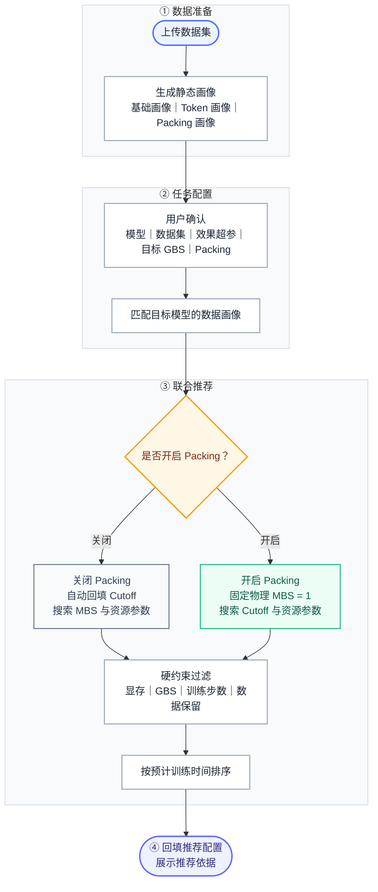

# 训练效率推荐流程

## 1. 目标

当前训练任务主要有两个问题：配置依赖经验，以及单卡批大小、序列长度、显存策略和卡数之间缺少联合判断，容易出现显存浪费、训练过慢或直接内存溢出（OOM）。

推荐器的目标是：**不改变用户训练效果约束，先生成数据画像，再联合推荐可执行且训练时间更短的资源与性能参数。**

> **产品原则：用户确认效果相关参数；系统推荐性能相关参数。**

## 2. 用户输入与系统推荐

### 2.1 用户确认的参数

结合当前任务创建页面，用户需要确认：

- 任务类型、模型、数据集和训练方法，例如 LoRA 或全量更新；
- 迭代轮次、学习率、LoRA 秩和缩放系数、学习率调度器等效果相关超参；
- 目标全局批大小（Global Batch Size，GBS）；
- 是否开启拼接（packing）；
- 最大样本数，以及是否允许截断数据。

### 2.2 系统推荐的参数

- 序列长度，即截断长度（`cutoff_len`）；
- 单卡批大小（Micro Batch Size，MBS）；
- 梯度累积步数（Gradient Accumulation，GA）；
- GPU 卡型与数量；
- ZeRO 阶段、梯度检查点（Gradient Checkpointing，GC）；
- 预计峰值显存和预计训练时间。

> **当前页面需要调整：**增加“目标 GBS”和“是否开启 packing”；“单卡批大小”改为推荐结果；“序列长度”在关闭 packing 时自动回填，在开启 packing 时由系统搜索。高级模式可以保留人工覆盖入口。

## 3. 数据集静态分析

数据集上传后异步生成数据画像，任务推荐阶段只读取画像，不再读取原始数据、重新分词或执行完整 packing。

### 3.1 基础画像

基础画像与模型无关，至少包括：

- 样本数、字段完整率和无效样本数；
- 对话轮数、角色结构和多模态样本数；
- 原始长度分布及数据版本。

### 3.2 Token 长度画像

使用实际训练处理链统计：

```plain text
基础 tokenizer
+ 对话模板
+ 特殊 token
+ 真实截断规则
```

输出文本 token 长度的平均值、P50、P90、P95、P99、最大值、总 token 数、标签 token 数及截断保留率曲线。纯文本数据集可以直接得到最终样本长度；图像/视频理解数据集在本阶段只得到非视觉部分长度，最终样本长度在用户创建任务后计算。

当前 Qwen 实验支持按两类基础 tokenizer 复用画像：

| 基础 tokenizer 组 | 当前实测结论 | 产品处理 |
|---|---|---|
| Qwen2、Qwen2.5、Qwen3 | 原始文本逐样本长度一致 | 生成一份基础画像，按已验证的模板规则修正 |
| Qwen3.5、Qwen3.6 | 原始文本逐样本长度一致 | 生成一份基础画像并直接复用 |
| 旧组与新组之间 | 中文 token 数相差约 9.79%，中英混合相差约 5.67% | 不能使用统一常数修正，分别生成基础画像 |

同一 tokenizer 组内，只有在模板版本和消息结构固定且修正规则已经验证时，才能使用常数或结构规则派生长度。工具调用、多轮结构变化和多模态任务未命中规则时，必须使用真实处理链重新计算。

> **模型在上传时未知不影响上传。**系统可以预计算常用 tokenizer 组；用户选择模型后只需匹配对应画像。画像未命中时先补算，不能回退到不匹配的长度分布。

#### 3.2.1 图像/视频理解数据集的静态画像

本阶段只记录数据集上传后能够直接获得的原始媒体信息，不使用模型处理器，也不引入用户尚未填写的最大像素数和视频抽帧频率。

| 数据类型 | 逐样本记录 | 数据集汇总 |
|---|---|---|
| 图片 | 每条样本的图片数；每张图片的原始宽度、原始高度、像素数和图片格式；无效图片数 | 每条样本图片数以及图片像素数的平均值、P50、P90、P95、P99 和最大值 |
| 视频 | 每条样本的视频数；每段视频的时长、原始帧率、原始宽高、原始帧数和视频格式；无效视频数 | 每条样本视频数、视频时长、原始帧数和像素数的平均值、P50、P90、P95、P99 和最大值 |

逐样本画像必须保留“样本—图片/视频”的对应关系，供任务创建后逐条计算视觉 token。上传阶段不计算最终视觉 token，也不计算最终样本长度。

### 3.3 Packing 画像

对候选截断长度使用与线上一致的 packing 算法，缓存：

- pack 利用率、pack 数量；
- 每个 pack 的逻辑样本数均值、P95、P99 和最大值；
- 样本截断率、token 保留率；
- 不同 shuffle 和分片方式下的波动。

缓存必须绑定数据集版本、tokenizer 组、模板版本、多模态处理器、packing 算法、分片方式和截断长度，避免画像与真实训练处理链不一致。

## 4. 用户创建任务后的分支

用户选择模型、数据集、效果超参、目标 GBS 和 packing 后，系统匹配对应数据画像，再进入以下分支。

### 4.1 图像/视频理解任务的推荐前计算

图像/视频理解任务在正式进入性能推荐前，需要将第 3 章的静态画像与用户参数、模型处理器合并，生成最终样本长度画像。

| 来源 | 图片任务 | 视频任务 |
|---|---|---|
| 静态画像 | 每条样本的图片数和每张图片的原始宽高 | 每条样本的视频数，以及每段视频的时长、原始帧率和原始宽高 |
| 用户填写 | 最大像素数（`max_pixels`） | 最大像素数（`max_pixels`）和目标抽帧频率（`fps`） |
| 目标模型 | 模型处理器和 tokenizer | 模型处理器和 tokenizer |

#### 图片任务

对第 $i$ 张图片，设原始宽高为 $W_i$、$H_i$，用户填写的最大像素数为 $P_{\max}$。产品层面的有效像素预算为：

$$
P_{\text{cap},i}=\min(W_iH_i,P_{\max})
$$

超过上限的图片由后端等比例缩小；未超过上限的图片不因最大像素数进行降采样。最小图片网格、缩放后宽高和 patch 对齐均由模型处理器内部完成，产品和用户不需要关心。

后端根据处理器返回的图片网格计算每张图片的视觉 token。设图片网格为 $(1,g_{h,i},g_{w,i})$，空间合并倍率为 $m$，则：

$$
N_{\text{vision},i}=\frac{g_{h,i}g_{w,i}}{m^2}
$$

这里的 $m$ 表示高、宽两个方向各合并多少个相邻 patch。以当前 Qwen2.5-VL 和 Qwen3-VL 的 $m=2$ 为例，每个 $2\times2=4$ 个 patch 合并成 1 个视觉 token，因此视觉 token 数除以 $2^2=4$，不是除以 2。该参数由模型结构固定，不需要用户填写，也不进入推荐搜索空间。

设 $L_{\text{nonvision}}$ 为该样本的文本、对话模板、特殊 token 和图片边界符长度，一条样本共有 $n$ 张图片，则最终样本长度为：

$$
L_{\text{sample}}=L_{\text{nonvision}}+
\sum_{i=1}^{n}N_{\text{vision},i}
$$

也就是每张图片分别计算视觉 token，然后按样本直接相加，再加上文本部分。

**计算示例，不是吞吐实测：**Qwen3-VL 的空间 patch 尺寸为 16、空间合并倍率为 2。若最大像素数为 $448\times448=200704$，一张 $448\times448$ 图片对应 196 个视觉 token；一张 $1024\times768$ 图片经后端处理后对应 192 个视觉 token。如果一条样本包含这两张图片，非视觉部分为 300 个 token，则样本总长度为 $300+196+192=688$。

#### 视频任务

视频任务先根据视频时长和用户填写的目标抽帧频率计算目标帧数，再由模型处理器完成实际抽帧、像素限制和时间维对齐。设处理器返回的视频网格为 $(g_t,g_h,g_w)$，则视频视觉 token 数为：

$$
N_{\text{vision}}=\frac{g_tg_hg_w}{m^2}
$$

同一样本包含多个视频时，仍然逐个计算后相加。视频任务还包含解码、抽帧和数据读取开销，因此后续显存和吞吐推荐不能直接复用图片系数。

完成上述计算后，系统生成最终样本长度的平均值、P50、P90、P95、P99 和最大值，作为截断长度、显存预测和吞吐推荐的输入。整个过程只读取静态画像，不重新读取原始图片或视频。

> **当前实现边界：**图片视觉 token 已支持按上述方式计算；真实视频分档标定尚未完成。当前多模态 packing 尚未支持，VL 任务固定关闭 packing。

| 用户选择 | 截断长度 | 单卡批大小 | GA |
|---|---|---|---|
| 关闭 packing | 自动取模型处理后的数据集最大 token 长度，并向上取到平台支持的最小档位 | 进入搜索空间 | 由 GBS 精确派生 |
| 开启 packing | 进入联合搜索空间 | 物理 MBS 固定为 1 | 根据每个 pack 的样本数分布派生 |

### 4.2 关闭 packing

截断长度只用于保证样本不被截断，因此默认值为目标模型处理后的最大 token 长度，不是原始字符长度。若最大长度超过模型上下文上限，必须提示用户选择截断策略或更换模型，不能静默截断。

非 packing 下满足：

$$
GBS = DP \times MBS \times GA
$$

其中 $DP$ 是数据并行卡数。

### 4.3 开启 packing

整齐拼接（neat packing）下物理 MBS 固定为 1，截断长度直接影响每步每卡处理的 token 数，因此必须和 GPU、显存策略、GBS 一起搜索。

- 默认搜索下界：保证不截断样本的最小合法长度；
- 搜索上界：模型上下文上限、显存可行上限、GBS 可控上限三者的最小值；
- 如果用户允许截断，才可以搜索低于数据集最大长度的候选；
- 截断长度越大不代表吞吐一定越高，还要同时检查显存、GBS 和优化器步数。

设平均每个 pack 的样本数为 $n_{\text{pack,mean}}$，则 GA 按平均值派生：

$$
GA = \max\left(1,\operatorname{round}\left(\frac{GBS}{DP\times n_{\text{pack,mean}}}\right)\right)
$$

单步安全约束必须使用 pack 内样本数的 P99 上界，而不是平均值：

$$
DP\times n_{\text{pack,step-p99}} \le GBS\times(1+\epsilon)
$$

其中 $\epsilon$ 是允许的 GBS 偏差。违反该约束的截断长度直接淘汰。

## 5. 联合推荐

### 5.1 搜索空间

```plain text
关闭 packing：GPU 卡型与数量 × ZeRO × GC × MBS
开启 packing：GPU 卡型与数量 × ZeRO × GC × cutoff_len，物理 MBS = 1
```

GA 始终由用户固定的 GBS 派生，不作为独立搜索变量。

### 5.2 过滤与排序

每个候选依次经过：

1. 框架和分布式配置兼容性检查；
2. GBS、整除关系及 packing 上尾约束检查；
3. 峰值显存预测，淘汰可能 OOM 的方案；
4. 优化器步数和数据保留约束检查；
5. 训练吞吐和总训练时间预测。

首版默认从较小资源等级开始搜索，在最小可行资源等级内选择预计训练时间最短的方案。后续可以增加“成本优先”和“速度优先”，但不能只按吞吐排序而忽略资源成本。

## 6. 推荐结果与页面回填

推荐结果至少展示：

```plain text
packing
cutoff_len
GPU 卡型和数量
MBS
GA
目标 GBS 与预计实际 GBS
ZeRO 阶段
是否开启 GC
预计峰值显存
预计训练时间
样本截断率与 token 保留率
packing 利用率和每个 pack 的样本数分布
```

在当前任务页面中：

- “单卡批大小”回填推荐 MBS；
- “序列长度”关闭 packing 时显示自动值，开启 packing 时显示搜索结果；
- 新增“推荐依据”，说明显存余量、预计训练时间和数据保留情况；
- 数据画像未完成时显示“数据分析中”，不生成临时推荐值。

## 7. 具体例子

以 Qwen3.6-27B 和实验中的长文本监督微调数据集为例，模型处理后的最大样本长度为 15,485 token。假设平台按 512 对齐：

- 关闭 packing：序列长度自动回填为 15,872，系统搜索 MBS、GPU、ZeRO 和 GC；
- 开启 packing：15,872 是不截断条件下的搜索下界，系统继续搜索更长截断长度，物理 MBS 固定为 1。

这说明同一数据集是否开启 packing，会改变序列长度和 MBS 的产品行为，但不会改变用户已经确认的模型、效果超参和目标 GBS。

## 8. 总体流程



## 9. 当前边界

- **实验观察：**Qwen tokenizer 当前只验证了上述两个等价组，不能直接外推到其他模型家族。
- **工程决策：**首版由用户决定是否开启 packing，系统只在所选分支内推荐参数。
- **待实测：**packing 引起的样本级单步 GBS 波动对训练效果的影响仍需继续验证。
- **多模态限制：**必须使用目标模型的真实 processor 统计视觉 token，不能使用文本占位符结果。

## 相关文章

- [Qwen 系列 Tokenizer 在不同类型数据集上的统计总结](https://docs.corp.kuaishou.com/d/home/fcADN95dyVWMdfjQTzQ-iwCC9)
- [Qwen3-14B SFT 全参三卡实验对比](https://docs.corp.kuaishou.com/n/home/fcAC8Y4VE5m-cZAfioEHtys3a)
- [Qwen3-8B SFT-LoRA 单卡实验对比](https://docs.corp.kuaishou.com/n/home/fcACsxpoSXu8g5hfTnl-a_oZ9)
