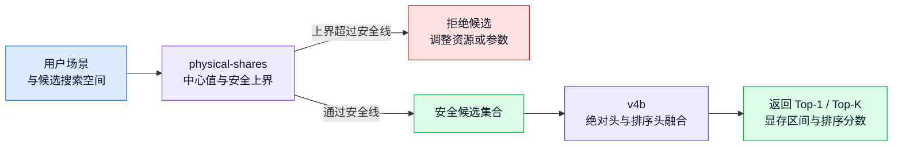

# 显存与吞吐模型协同建模说明

> 文档日期：2026-07-29  
> 当前定位：H800 纯文本监督微调（Supervised Fine-Tuning，SFT）的显存安全筛选与吞吐排序  
> 对应冻结模型：physical-shares 显存模型 + v4b 吞吐模型

## 1. 推荐器先筛显存安全，再优化训练速度

### 1.1 系统需要解决的决策

给定一个用户训练场景，推荐器需要从多组资源与训练参数中选择一个避免显存溢出（Out of Memory，OOM）、吞吐接近最优的配置。这里将输入分成两类：

| 输入类别 | 典型字段 | 在一次推荐中的角色 |
|---|---|---|
| 场景条件 | 卡型、模型结构、全量微调（Full）/低秩适配（Low-Rank Adaptation，LoRA）、数据 profile、目标全局 batch size（GBS） | 由用户任务确定，候选之间保持一致 |
| 搜索参数 | GPU 数、micro batch size（MBS）、ZeRO stage、梯度检查点（GC）、样本拼接（packing）、kernel | 由推荐器生成并比较 |

文中把一组固定的场景条件称为**场景**，把场景内某一组搜索参数称为**候选**。推荐器对候选执行两个阶段：

| 阶段 | 模型 | 核心输出 | 决策 |
|---|---|---|---|
| 显存安全筛选 | physical-shares | 中心显存 $M_{\mathrm{center}}$、安全上界 $M_{\mathrm{upper}}$ | 拒绝可能超出安全线的候选 |
| 安全候选排序 | v4b | 每个候选的融合分数 $s_i$ | 在已放行候选中选择 Top-1 或 Top-K |

因此，系统从模型结构、数据工作量和训练配置中计算特征，并对新候选进行推断；运行时无需在历史实验表中找到完全相同的配置。

### 1.2 端到端决策流程

*图 1：physical-shares 与 v4b 的端到端协同流程。*

当安全候选集合为空时，推荐器应提示增加 GPU、降低 MBS 或 cutoff length、开启 GC 等调整方向。v4b 只接收 physical-shares 放行的候选。

### 1.3 一个真实回放示例

Qwen3.5-4B Full 场景包含以下四个吞吐候选。physical-shares 已放行该批回放中的全部吞吐候选，v4b 再对四个候选排序：

| 候选 | GPU | MBS | ZeRO | GC | 实测吞吐 | $\exp(s_i)$ 辅助尺度 | 实测名次 | 预测名次 |
|---|---:|---:|---:|---|---:|---:|---:|---:|
| A | 2 | 4 | 2 | 关闭 | 2022.257 | 5037.289 | 1 | 1 |
| B | 1 | 4 | 0 | 开启 | 976.688 | 2608.343 | 2 | 2 |
| C | 2 | 2 | 3 | 开启 | 478.320 | 1283.914 | 3 | 3 |
| D | 1 | 1 | 0 | 开启 | 255.966 | 699.427 | 4 | 4 |

这个例子展示了两件事。第一，v4b 排对了四个候选并选中真实最快的 A，Top-1 regret 为 0。第二，$\exp(s_i)$ 整体高于实测吞吐，绝对数值存在明显尺度漂移。当前产品决策使用排序和 regret；Qwen3.5 上的绝对吞吐数值只作为辅助尺度。

## 2. 关键术语贯穿两套模型

| 术语 | 定义 | 使用位置 |
|---|---|---|
| 中心预测 | 对最可能显存或吞吐尺度的点估计 | 显存误差诊断、v4b 绝对头 |
| 安全上界 | 在中心显存上叠加成功残差尾部与 OOM 保护项 | physical-shares 放行决策 |
| 场景内候选对 | 同一场景中两个可比较配置 $(i,j)$ | v4b pairwise 排序头 |
| pooled 指标 | 将所有观测或候选对合并后计算 | 反映总体样本表现 |
| 场景等权指标 | 先在每个场景计算，再对场景平均 | 反映每个用户请求同等重要时的表现 |
| 独立泛化回放 | 冻结模型后采集、未参与拟合和调参的实验 | 判断对新模型或数据的迁移能力 |
| regret | 推荐配置相对真实最快配置的吞吐损失比例 | 衡量最终推荐代价 |

显存模型的业务目标侧重 OOM 安全与合理放行率。吞吐模型的业务目标侧重候选顺序、Top-1 regret 和 Hit@90%；绝对吞吐误差用于识别尺度漂移。

## 3. physical-shares 用物理基线承接规模变化

### 3.1 模型输出由中心值和安全上界组成

physical-shares 先计算一个可解释的解析显存基线 $M_{\mathrm{ref}}$，再用 28 维统计模型学习实测显存相对基线的修正倍数：

$$
M_{\mathrm{center}}
=
M_{\mathrm{ref}}
\exp\!\left(
b+\widetilde{x}^{\top}\beta
\right).
$$

随后，模型根据折外成功残差和已知 OOM 下界构造保护量 $g$：

$$
M_{\mathrm{upper}}
=
M_{\mathrm{center}}\exp(g).
$$

这两层分别承担不同职责。$M_{\mathrm{center}}$ 用于显存量级估计，$M_{\mathrm{upper}}$ 用于上线时的保守放行。

### 3.2 物理基线拆分为九类显存分量

设：

| 符号 | 含义 |
|---|---|
| $P_{\mathrm{load}}$、$P_{\mathrm{train}}$ | 加载参数量、可训练参数量 |
| $G$、$B$、$S$ | GPU 数、MBS、cutoff length |
| $L$、$H$、$I$ | Transformer 层数、hidden size、前馈网络（Feed-Forward Network，FFN）intermediate size |
| $H_{\mathrm{kv}}$、$N_h$、$V$ | Key-Value（KV）hidden width、Attention head 数、词表大小 |
| $b_p$、$b_g$、$b_o$、$b_l$ | 参数、梯度、优化器状态、logits 的每元素字节数 |

当前 BF16/AdamW 近似使用：

$$
b_p=2,\qquad b_g=2,\qquad b_o=12,\qquad b_l=4.
$$

$b_o=12$ 近似覆盖 FP32 master weight 和两个 FP32 moment。物理基线包含九项：

| 编号 | 分量 | 主要来源 |
|---:|---|---|
| 1 | $C_{\mathrm{param}}$ | 模型参数 |
| 2 | $C_{\mathrm{grad}}$ | 梯度 |
| 3 | $C_{\mathrm{opt}}$ | 优化器状态 |
| 4 | $C_{\mathrm{saved}}$ | 跨层保存的激活 |
| 5 | $C_{\mathrm{recompute}}$ | GC 的单层重算工作区 |
| 6 | $C_{\mathrm{attn}}$ | Attention 工作区 |
| 7 | $C_{\mathrm{logits}}$ | Logits 工作区 |
| 8 | $C_{\mathrm{zero}}$ | ZeRO 通信工作区 |
| 9 | $C_{\mathrm{stage3}}$ | ZeRO-3 临时聚合的活跃参数 |

最终求和：

$$
M_{\mathrm{ref}}=\sum_{k=1}^{9}C_k.
$$

这个基线会随真实参数量、模型结构、序列长度和并行配置变化，因此能够承接 4B、14B、32B 等模型规模变化。它属于解析参考模型，CUDA tensor 生命周期、allocator 碎片和算子峰值重叠等偏差交给后续统计层修正。

### 3.3 ZeRO 分片决定状态显存

Zero Redundancy Optimizer（ZeRO）通过分片训练状态降低单卡占用。参数、梯度和优化器状态写为：

$$
C_{\mathrm{param}}
=
\frac{b_pP_{\mathrm{load}}}{s_p(z,G)},
\qquad
C_{\mathrm{grad}}
=
\frac{b_gP_{\mathrm{train}}}{s_g(z,G)},
\qquad
C_{\mathrm{opt}}
=
\frac{b_oP_{\mathrm{train}}}{s_o(z,G)}.
$$

其中 $z$ 表示 ZeRO stage，分片因子如下：

| ZeRO stage | $s_p(z,G)$：参数 | $s_g(z,G)$：梯度 | $s_o(z,G)$：优化器 |
|---:|---:|---:|---:|
| 0 | $1$ | $1$ | $1$ |
| 1 | $1$ | $1$ | $G$ |
| 2 | $1$ | $G$ | $G$ |
| 3 | $G$ | $G$ | $G$ |

ZeRO-1 分片优化器状态，ZeRO-2 继续分片梯度，ZeRO-3 继续分片参数。

### 3.4 GC 改变激活保存方式

先定义一层、一个 token 的解析激活元素数：

$$
A_{\mathrm{token}}=6H+2H_{\mathrm{kv}}+3I.
$$

该式近似聚合 Attention 投影、MLP 中间张量和残差相关张量。保存激活与重算工作区分别为：

$$
C_{\mathrm{saved}}
\approx
\begin{cases}
BSLA_{\mathrm{token}}b_p, & \mathrm{GC}=0,\\
BSLHb_p, & \mathrm{GC}=1,
\end{cases}
$$

$$
C_{\mathrm{recompute}}
\approx
\begin{cases}
0, & \mathrm{GC}=0,\\
BSA_{\mathrm{token}}b_p, & \mathrm{GC}=1.
\end{cases}
$$

开启 GC 后，跨层保存的主体从 $A_{\mathrm{token}}$ 缩减为 $H$，同时增加一个不随层数 $L$ 放大的单层重算工作区。

### 3.5 算子与通信工作区补足瞬时开销

当前 fused/Flash Attention 路径使用以下近似：

$$
C_{\mathrm{attn}}
\approx
BS(2H+2H_{\mathrm{kv}})b_p+4BN_hS,
$$

$$
C_{\mathrm{logits}}
\approx
BSVb_l.
$$

该 Attention 公式不保留传统的完整 $BN_hS^2$ 注意力矩阵。cutoff length 相同只约束序列上限；不同数据分布与 packing 会改变每步有效 token、填充比例、样本拼接形态和 kernel 行为。当前物理公式无法完整表达这些差异，packing 标记与统计残差只能提供有限补偿，因此数据分布仍属于需要扩展验证的维度。

设 reduce bucket 和 all-gather bucket 的元素上限为 $E_{\mathrm{reduce}}$ 与 $E_{\mathrm{gather}}$：

$$
R=b_g\min(P_{\mathrm{train}},E_{\mathrm{reduce}}),
\qquad
A_g=b_p\min(P_{\mathrm{train}},E_{\mathrm{gather}}).
$$

ZeRO 通信工作区近似为：

$$
C_{\mathrm{zero}}
=
\begin{cases}
0, & z=0,\\
R, & z=1,\\
\max(R,A_g), & z=2,\\
R, & z=3.
\end{cases}
$$

ZeRO-3 还会临时聚合当前活跃参数。设 $E_{\mathrm{live}}$ 是由最大模块、持久参数和 live/reuse 阈值共同截断后的活跃元素数，则：

$$
C_{\mathrm{stage3}}
\approx
b_pE_{\mathrm{live}}
\left(1-\frac{1}{G}\right).
$$

## 4. 28 维残差模型修正系统性误差

### 4.1 学习目标是相对物理基线的倍数

对成功实验 $i$，记实测 reserved memory 为 $M_i$。残差目标定义为：

$$
y_i=\log\frac{M_i}{M_{\mathrm{ref},i}}.
$$

对数变换将乘法修正变成加法回归，也保证还原后的显存预测为正。

### 4.2 特征由 19 维机制项和 9 维物理占比组成

令 $\ell$、$c$、$z_2$、$z_3$ 分别表示 LoRA、GC、ZeRO-2、ZeRO-3 的 0/1 指示变量，并定义：

$$
g_G=\log_2G,\qquad
m_B=\log_2B,\qquad
s_S=\log_2\frac{S}{512},\qquad
p_P=\log_2\frac{P_{\mathrm{base}}}{P_0}.
$$

这里采用带语义的下标，避免将 GPU 对数 $g_G$ 与后文安全保护量 $g$ 混淆。缩放锚点

$$
P_0=2{,}031{,}739{,}904
$$

来自 Qwen3-1.7B 的实际参数量，$P_{\mathrm{base}}$ 表示当前基础模型的总参数量。改变锚点只会平移相应特征和截距，不会改变参数量之间的相对比例。

19 维训练机制与尺度向量为：

$$
\begin{aligned}
x_{\mathrm{mech}}=\big(&
\ell,c,z_2,z_3,
\ell c,\ell z_2,\ell z_3,cz_2,cz_3,
\ell z_3(1-c),\\
&g_G,m_B,s_S,p_P,
\ell p_P,cs_S,z_2g_G,z_3g_G,m_Bs_S
\big).
\end{aligned}
$$

每个物理分量的占比为：

$$
r_k=\frac{C_k}{M_{\mathrm{ref}}},
\qquad
\sum_{k=1}^{9}r_k=1.
$$

最终特征为：

$$
x=
\left(
x_{\mathrm{mech}},
r_1,\ldots,r_9
\right)
\in\mathbb{R}^{28}.
$$

九个占比描述同一显存总量的组成。例如，参数占主导和激活占主导的两个候选即使拥有相同 $M_{\mathrm{ref}}$，也可能呈现不同的 allocator 和临时工作区偏差。

### 4.3 场景平衡的岭回归稳定小样本拟合

对第 $j$ 个特征使用训练集均值 $\mu_j$ 和尺度 $\sigma_j$ 标准化：

$$
\widetilde{x}_{ij}
=
\frac{x_{ij}-\mu_j}{\sigma_j}.
$$

模型通过带 L2 正则的加权岭回归求解：

$$
\min_{b,\beta}
\sum_i\omega_i
\left(
y_i-b-\widetilde{x}_i^\top\beta
\right)^2
+\alpha\lVert\beta\rVert_2^2.
$$

若样本 $i$ 属于场景 $s(i)$，该场景包含 $n_{s(i)}$ 个成功点，则：

$$
\omega_i
=
\frac{h_i}{n_{s(i)}},
\qquad
h_i=
\begin{cases}
0.25, & \text{历史实验},\\
1, & \text{原生校准实验}.
\end{cases}
$$

场景内样本越多，单个样本权重越小；一个原生场景的总权重约为 1，历史场景的总影响缩放为 0.25。该设计抑制重复点较多的场景对模型的支配。

记标准化设计矩阵为 $D=[\mathbf{1},\widetilde{X}]$，$W=\operatorname{diag}(\omega_i)$，$R=\operatorname{diag}(0,1,\ldots,1)$，闭式解为：

$$
\widehat{\theta}
=
\left(
D^\top WD+\alpha R
\right)^+
D^\top Wy.
$$

$(\cdot)^+$ 表示 Moore-Penrose 伪逆，$R$ 的第一维为 0，因此截距不受正则化。九个 share 的和恒为 1，交叉特征也存在相关性；伪逆与岭惩罚共同提升系数稳定性。冻结模型使用 $\alpha=1$，中心模型共使用 624 个成功观测、53 个场景。

## 5. 折外尾部校准把中心值转成安全上界

### 5.1 成功实验提供上尾残差

安全校准先通过内层 leave-one-scenario-out（LOSO）得到每个成功点的折外中心预测，再计算：

$$
e_i
=
\log\frac{M_i}{M_{\mathrm{center},i}}.
$$

在同一校准桶中，将 $n$ 个成功残差排序为
$e_{(1)}\le\cdots\le e_{(n)}$。有限样本 95% 上分位点取：

$$
k=
\left\lceil
(n+1)\times0.95
\right\rceil,
\qquad
q_{0.95}=e_{(k)}.
$$

当 $k\le n$ 时该分位点有效，因此 95% 覆盖至少需要 19 个成功残差。校准桶按以下顺序回退：

| 优先级 | 校准范围 | 组成 |
|---:|---|---|
| 1 | 精确 selector | Full/LoRA、ZeRO stage、GC、packing |
| 2 | 机制组 | 训练模式 × GC |
| 3 | pooled | 全部可用成功残差 |

折外残差保证被评估场景未参与自身中心模型拟合，减少训练内残差过小造成的尾部乐观。

### 5.2 OOM 实验提供右删失保护

OOM 只表明真实需求超过已知下界。$M_{\mathrm{oom\_lower},i}$ 表示运行日志能确认的占用下界，$M_{\mathrm{safe},i}$ 表示该运行使用的安全线。对 OOM 点 $i$ 定义：

$$
F_i
=
\max\left(
M_{\mathrm{oom\_lower},i},
M_{\mathrm{safe},i}+1\ \mathrm{byte}
\right).
$$

在相同精确 selector 内，OOM 保护项为：

$$
g_{\mathrm{oom}}
=
\max_{i\in\mathcal{O}_{\mathrm{selector}}}
\log\frac{F_i}{M_{\mathrm{center},i}}.
$$

OOM 观测以右删失约束参与校准，不被转换成虚构的峰值回归标签。保护项只在相同 Full/LoRA、ZeRO、GC、packing 组合中传播，以控制跨机制外推。

### 5.3 放行规则使用三重保护中的最大值

最终保护量与安全上界为：

$$
g=
\max\left(
0,\ q_{0.95},\ g_{\mathrm{oom}}
\right),
$$

$$
M_{\mathrm{upper}}
=
M_{\mathrm{center}}\exp(g).
$$

H800 当前将卡容量的 95% 设为安全线：

$$
M_{\mathrm{safe}}
=
0.95M_{\mathrm{capacity}}
=
132.839\ \mathrm{GiB}.
$$

放行规则为：

$$
\operatorname{admit}(x)
=
\mathbf{1}
\left[
M_{\mathrm{upper}}(x)
\le
M_{\mathrm{safe}}
\right].
$$

缺少有效安全上界的候选执行保守拒绝。$M_{\mathrm{upper}}$ 属于 operational upper bound：其覆盖解释依赖校准残差与未来请求近似可交换，也依赖请求位于已验证支持域内。跨卡型、跨模态或明显超出训练分布时，95% 分位点不构成无条件概率保证。

## 6. v4b 用双头模型学习绝对尺度与相对顺序

### 6.1 70 维输入是派生特征空间

v4b 的绝对头和 pairwise 头共享 70 维特征。大部分维度由底层配置、模型结构和数据 profile 确定性计算得到。表中的 FLOPs 表示浮点运算量，HBM 表示高带宽显存（High Bandwidth Memory）：

| 特征组 | 数量 | 主要内容 |
|---|---:|---|
| 训练、kernel、数据类别 | 17 | Full/LoRA、GC、packing、ZeRO、FA2/FA3、Liger、数据类别 |
| 资源与 batch | 5 | GPU 数、MBS、梯度累积、GBS、cutoff |
| 模型结构 | 10 | 参数量、可训练参数、层数、hidden、FFN、head、词表、LoRA rank |
| 数据工作量 | 8 | 每步有效/计算 token、样本数、Attention pairs、token 利用率 |
| 解析物理工作量 | 13 | FLOPs、HBM 流量、优化器流量、通信量、理想计算/通信时间 |
| 硬件描述 | 3 | 峰值算力、HBM 带宽、互联带宽 |
| 交叉项 | 14 | GC、ZeRO、MBS、GPU 数与模型规模之间的交互 |
| 合计 | 70 | 共享输入空间 |

70 维代表 70 个建模坐标，其中包含一组底层变量的物理派生量和交叉项。强相关特征通过标准化和岭正则控制。当前 H800 v4b 使用 238 个聚合候选、63 个场景和 1200 个场景内候选对完成冻结拟合。

设场景 $s$ 中候选 $i$ 的特征为 $x_{s,i}\in\mathbb{R}^{70}$：

$$
\widetilde{x}_{s,ij}
=
\frac{x_{s,ij}-\mu_j}{\sigma_j}.
$$

训练和推断必须复用冻结产物中的 $\mu_j$、$\sigma_j$ 与特征顺序。

### 6.2 绝对头直接预测 log step time

设候选 $i$ 的实测 step time 为 $t_i$，每步有效 token 数为 $u_i$。绝对头预测：

$$
\widehat{\log t_i}
=
b_a+\widetilde{x}_{i}^{\top}\beta.
$$

对应的 log throughput 分数为：

$$
a_i
=
\log u_i-\widehat{\log t_i}.
$$

其中 $b_a$ 是截距，$\beta\in\mathbb{R}^{70}$ 是绝对头系数，$a_i$ 位于 log throughput 空间。冻结模型使用 `direct_log_step` 目标。解析 FLOPs、HBM 时间和通信时间作为 70 维特征输入，模型直接学习 $\log t_i$；对数空间能够表达吞吐与耗时中的乘法比例，并保证还原后的耗时和吞吐为正。

记 $P$ 为全部场景内候选对集合，$\omega_i$ 与 $\omega_{ij}$ 分别表示单点和候选对权重。绝对头同时优化单点 step time 和场景内 step-time 差值：

$$
\begin{aligned}
\mathcal{L}_a
={}&
\sum_i\omega_i
\rho_\delta
\left(
\log t_i-\widehat{\log t_i}
\right)\\
&+
\eta
\sum_{(i,j)\in P}
\omega_{ij}
\rho_\delta
\left[
(\log t_i-\log t_j)
-
(\widehat{\log t_i}-\widehat{\log t_j})
\right]\\
&+
\alpha_a\lVert\beta\rVert_2^2.
\end{aligned}
$$

Huber loss 定义为：

$$
\rho_\delta(e)
=
\begin{cases}
\dfrac{1}{2}e^2, & |e|\le\delta,\\
\delta\left(|e|-\dfrac{1}{2}\delta\right), & |e|>\delta.
\end{cases}
$$

冻结参数为：

$$
\alpha_a=1,\qquad \eta=0.25,\qquad \delta=0.35.
$$

小残差使用平方损失，超过阈值后转为线性增长，从而降低异常慢点的影响。实现采用迭代重加权最小二乘（Iteratively Reweighted Least Squares，IRLS）：

$$
w_{\mathrm{Huber}}^{(k)}(e)
=
\begin{cases}
1, & |e|\le\delta,\\
\dfrac{\delta}{|e|}, & |e|>\delta,
\end{cases}
$$

$$
\theta^{(k+1)}
=
\left(
D^\top W^{(k)}D+\alpha R
\right)^+
D^\top W^{(k)}y.
$$

这里 $D$ 是当前头的设计矩阵，$W^{(k)}$ 同时合并场景权重与第 $k$ 轮 Huber 权重，$R$ 保持截距不受正则化。

单点的场景内权重为 $h_s/n_s$；pair 项在场景内的总权重为 $\eta h_s$，再平均分配给该场景的所有候选对。与显存模型一致，原生场景取 $h_s=1$，历史场景取 $h_s=0.25$。候选较多的场景由此保持受控权重。

### 6.3 pairwise 头直接拟合候选差值

实测吞吐为：

$$
q_i=\frac{u_i}{t_i}.
$$

对同一场景内候选对 $(i,j)$，监督信号是 log throughput 差值：

$$
d_{ij}
=
\log q_i-\log q_j.
$$

pairwise 头给出线性排序分数：

$$
r_i
=
\widetilde{x}_{i}^{\top}\gamma,
$$

其中 $\gamma\in\mathbb{R}^{70}$ 是排序头系数。模型优化：

$$
\mathcal{L}_r
=
\sum_{(i,j)\in P}
\omega_{ij}
\rho_\delta
\left[
d_{ij}
-
(\widetilde{x}_i-\widetilde{x}_j)^\top\gamma
\right]
+\alpha_r\lVert\gamma\rVert_2^2.
$$

冻结模型使用 $\alpha_r=0.01$ 和 $\delta=0.35$。排序头的训练目标与“候选 $i$ 和 $j$ 谁更快”直接对齐。

pairwise 学习对共同尺度漂移具有抵抗力。假设场景 $s$ 的 log throughput 可以写为：

$$
\log q_{s,i}
=
c_s+f(x_{s,i})+\varepsilon_{s,i},
$$

其中 $c_s$ 表示模型架构、软件版本或数据集带来的场景级共同偏置。场景内做差后：

$$
\begin{aligned}
\log q_{s,i}-\log q_{s,j}
={}&
f(x_{s,i})-f(x_{s,j})\\
&+
\varepsilon_{s,i}-\varepsilon_{s,j}.
\end{aligned}
$$

$c_s$ 在差分中抵消。这解释了 Qwen3.5 回放中“绝对 MAPE 很大、候选顺序仍正确”的现象。该性质覆盖同一场景内的近似共同缩放；当新架构改变 MBS、GC、ZeRO 等配置的相对收益时，函数 $f$ 发生变化，排序仍可能失效。

### 6.4 双头融合以 pairwise 结果为主

对同一场景内已通过显存筛选的候选集合 $C$，定义：

$$
\bar a_C
=
\frac{1}{|C|}
\sum_{j\in C}a_j,
\qquad
\bar r_C
=
\frac{1}{|C|}
\sum_{j\in C}r_j.
$$

最终 log score 为：

$$
s_i
=
\bar a_C
+\lambda(a_i-\bar a_C)
+(1-\lambda)(r_i-\bar r_C).
$$

当前使用 $\lambda=0.25$。相对差异中，绝对头贡献 25%，pairwise 头贡献 75%。候选按 $s_i$ 从大到小排序。

### 6.5 候选集合只确定融合分数的零点

任意两个保留候选的分数差为：

$$
s_i-s_j
=
\lambda(a_i-a_j)
+(1-\lambda)(r_i-r_j).
$$

集合均值 $\bar a_C$ 与 $\bar r_C$ 在差值中消失。因此，增加或删除其他候选会平移融合分数的公共零点，保留下来的两个候选之间顺序保持不变。候选仍需来自同一场景，跨场景分数没有直接可比性。

候选集合只有一个元素时，融合式退化为 $s_i=a_i$。$\exp(s_i)$ 可以提供候选集合内的辅助吞吐尺度。pairwise 头本身只由差值训练，其绝对零点没有业务含义；场景发生尺度漂移时，$\exp(s_i)$ 也不承担可靠 tokens/s 承诺。

## 7. 两套模型的协同误差需要分层验收

### 7.1 显存指标分别衡量精度、安全和利用率

设成功点集合为 $\mathcal{S}$，OOM 点集合为 $\mathcal{O}$。中心显存平均绝对百分比误差（Mean Absolute Percentage Error，MAPE）为：

$$
\operatorname{MAPE}_{\mathrm{memory}}
=
\frac{1}{|\mathcal{S}|}
\sum_{i\in\mathcal{S}}
\left|
\frac{M_{\mathrm{center},i}-M_i}{M_i}
\right|.
$$

它反映显存点估计的平均偏差。安全决策还需要两个方向的指标：

$$
\operatorname{FalseSafe}
=
\frac{
\sum_{i\in\mathcal{O}}
\mathbf{1}[\operatorname{admit}(x_i)=1]
}{
|\mathcal{O}|
},
$$

$$
\operatorname{SafeRecall}
=
\frac{
\sum_{i\in\mathcal{S}_{\mathrm{safe}}}
\mathbf{1}[\operatorname{admit}(x_i)=1]
}{
|\mathcal{S}_{\mathrm{safe}}|
}.
$$

$\mathcal{S}_{\mathrm{safe}}$ 表示实测显存位于安全线以内的成功点。FalseSafe 衡量已知 OOM 被误放行的比例，SafeRecall 衡量客观安全候选被释放的比例。前者关联运行安全，后者关联资源利用率。

成功点的上界覆盖率为：

$$
\operatorname{UpperCoverage}
=
\frac{1}{|\mathcal{S}|}
\sum_{i\in\mathcal{S}}
\mathbf{1}
\left[
M_i\le M_{\mathrm{upper},i}
\right].
$$

中心 MAPE 较小仍可能伴随尾部低估，因此 UpperCoverage 必须独立检查。

### 7.2 吞吐指标分别衡量全局顺序和最终选择

设场景 $s$ 中非并列候选对集合为 $P_s$。pairwise accuracy 为：

$$
\operatorname{Acc}_s
=
\frac{1}{|P_s|}
\sum_{(i,j)\in P_s}
\mathbf{1}
\left[
(s_{s,i}-s_{s,j})(q_{s,i}-q_{s,j})>0
\right].
$$

pooled accuracy 汇总全部候选对；场景等权 accuracy 先计算每个 $\operatorname{Acc}_s$，再对场景平均。后者更接近“每个用户请求权重相同”的产品口径。

令真实最快候选和模型首选候选分别为：

$$
i^*
=
\arg\max_iq_{s,i},
\qquad
\widehat{i}
=
\arg\max_is_{s,i}.
$$

Top-1 regret 为：

$$
\operatorname{Regret}_s
=
\max\left(
0,\,
1-\frac{q_{s,\widehat{i}}}{q_{s,i^*}}
\right).
$$

regret 为 0.04 表示推荐配置比真实最快配置慢 4%。达到真实最优吞吐 90% 的指标为：

$$
\operatorname{Hit@90\%}_s
=
\mathbf{1}
\left[
\operatorname{Regret}_s\le0.10
\right].
$$

令 $\widehat q_i=\exp(s_i)$ 表示融合模型给出的辅助吞吐预测。绝对吞吐 MAPE 为：

$$
\operatorname{MAPE}_{\mathrm{throughput}}
=
\frac{1}{N}
\sum_{i=1}^{N}
\left|
\frac{\widehat{q}_i-q_i}{q_i}
\right|.
$$

pairwise accuracy 检查整体顺序，regret 检查最终推荐代价，Hit@90% 检查是否达到产品目标，吞吐 MAPE 检查绝对数值的可信程度。

### 7.3 模型选择按完整场景留出

v4b 超参数在完整场景 LOSO 中选择，目标函数为：

$$
\begin{aligned}
J={}&
\operatorname{RMSE}_{\log q,\mathrm{scenario}}
+0.5\left(
1-\operatorname{Acc}_{\mathrm{scenario}}
\right)\\
&+
\operatorname{Regret}_{\mathrm{scenario}}
+0.5\operatorname{Regret}_{\mathrm{fixed\ GPU}}.
\end{aligned}
$$

该目标联合约束绝对尺度、场景等权排序、Top-1 损失和固定 GPU 数下的推荐损失。完整场景留出可以阻止同一模型与数据场景中的近重复配置同时进入训练折和验证折。

physical-shares 的安全尾部也使用折外场景残差。两套模型均把“新场景泛化”作为验证单位。

## 8. 现有证据区分内部校准、冻结 holdout 和新增实验

### 8.1 三类证据承担不同结论

| 数据划分 | 参与最终拟合 | 参与模型选择 | 可支持的解释 |
|---|---:|---:|---|
| 原始校准集 nested LOSO | 是，冻结时回收使用 | 是，每折完整留出一个场景 | 内部场景级泛化估计 |
| 原有冻结 holdout | 否 | 否 | 老实验中的独立比较诊断 |
| 后续新增泛化实验 | 否 | 否 | 冻结模型面对新模型、架构或数据的外部验证 |

原有冻结 holdout 在早期阶段已经被查看，因此其定位是冻结模型比较诊断。后续新增实验的采集时间晚于模型冻结，对当前泛化判断提供更强证据。训练集 in-sample 指标只用于收敛检查，本节不将其作为泛化成绩。

physical-shares 冻结中心模型记录的 624 个成功观测、53 个场景属于 pooled 拟合口径；下表的 112 个成功点属于原生校准集 nested LOSO 指标口径。两组数字对应不同的数据范围与评估单位。

### 8.2 physical-shares 在原始覆盖域内保持零 OOM 误放行

| 评估划分 | 成功点 | OOM 点 | 中心 MAPE | OOM 误放行 | 安全点放行率 | 成功上界覆盖率 |
|---|---:|---:|---:|---:|---:|---:|
| 原始校准集 nested LOSO | 112 | 46 | 6.67% | 0/46 | 85/100 = 85.00% | 111/112 = 99.11% |
| 原有冻结 holdout | 120 | 47 | 5.55% | 0/47 | 99/114 = 86.84% | 116/120 = 96.67% |

nested LOSO 在每一折留出完整场景，并在其余场景上重新拟合中心模型与尾部校准。原有 holdout 的 120 个成功点和 47 个 OOM 点未参与中心模型拟合、安全上界或超参数选择。

结果显示，原始覆盖域内的中心误差约为 5.55% 至 6.67%，93 个已知 OOM 全部被拒绝。保守策略的代价是约 13% 至 15% 的客观安全点也会被拒绝。

### 8.3 physical-shares 的新增回放揭示了 Qwen3.5 尾部缺口

| 独立验证 | 样本组成 | 中心 MAPE | OOM 误放行 | 安全点放行率 | 上界覆盖率 |
|---|---|---:|---:|---:|---:|
| Qwen2.5 | 59 成功 + 1 OOM | 6.80% | 0/1 | 85.19% | — |
| Qwen3-32B Full | 4 OOM | — | 0/4 | — | — |
| Qwen3-32B LoRA | 9 成功 + 3 OOM | 8.26% | 0/3 | 100% | 100% |
| Qwen3.5-4B 边界实验 | 5 成功 + 4 OOM | 13.84% | 0/4 | 80% | 60% |

这些 H800 纯文本独立证据包含 12 个 OOM，全部被拒绝。Qwen3.5 边界实验的中心 MAPE 上升到 13.84%，成功上界覆盖率降至 60%。因此当前 `operational_p95` 在 Qwen3.5 边界场景中仍是工程保护上界，尚未达到严格校准的统计 P95。

现有 Qwen3-VL 显存回放表现较差，表明视觉 token、图像编码器与多模态算子需要单独的物理分量和校准数据。

### 8.4 v4b 在原始实验中优先保证低 regret

| 评估划分 | 候选 | 场景 | 候选对 | pooled 准确率 | 场景等权准确率 | 绝对 MAPE | 场景等权 MAPE | Top-1 regret | Hit@90% |
|---|---:|---:|---:|---:|---:|---:|---:|---:|---:|
| 原始校准集场景级 LOSO | 104 | 19 | 839 | 94.64% | 94.33% | 26.77% | 21.21% | 0.17% | 100% |
| 原有冻结 holdout | 79 | 16 | 541 | 90.39% | 94.03% | 19.94% | 18.57% | 1.57% | 90% |

原有 holdout 上场景等权准确率为 94.03%，平均 Top-1 regret 为 1.57%。Hit@90% 为 90%，说明 10% 的可评估场景未达到真实最优吞吐的 90%。pooled 准确率低于场景等权准确率，说明少数候选较多的场景贡献了较多错序。

### 8.5 v4b 的新增回放显示排序迁移强于绝对尺度迁移

| 独立 holdout | 成功运行 | 候选对 | 排序准确率 | 绝对 MAPE | Top-1 regret |
|---|---:|---:|---:|---:|---:|
| Qwen2.5 | 23 | 27 | 100% | 9.71% | 0% |
| Qwen3 strict post-artifact（含 VL） | 16 | 13 | 92.31% | 16.21% | 0% |
| Qwen3.5-4B | 16 | 12 | 100% | 127.24% | 0% |
| 合计 | 55 | 52 | 51/52 = 98.08% | 不合并 | 所有已评估场景均为 0% |

三批新增验证共排对 51/52 个候选对，所有已评估场景都选中了真实最快配置。Qwen3.5 的绝对 MAPE 为 127.24%，同时保持 12/12 候选对正确和 Top-1 regret 为 0。这一结果支持当前的产品用法：v4b 适合承担安全候选内排序，Qwen3.5 绝对 tokens/s 仍需新的尺度校准。

### 8.6 Qwen3.5 端到端回放已验证顺序，尚缺混合风险候选集

最新 Qwen3.5 follow-up 共完成 25 个实验，其中 21 个成功、4 个 OOM、0 个其他失败。用于吞吐排序的 16 个成功候选全部通过 physical-shares；v4b 在 Full 与 LoRA 两个四候选场景中均选中真实最快配置，平均 regret 为 0，选中项没有 OOM。

这两个吞吐场景的候选集合全部由成功运行组成。严格端到端验收还需要在同一场景中同时放入 OOM、显存边界点和多个安全候选，从而联合观察：

| 风险 | 对最终推荐的影响 | 对应验收指标 |
|---|---|---|
| physical-shares 误放行 OOM | 推荐器可能选择不可运行配置 | 端到端 OOM 选择率 |
| physical-shares 误拒真实最快安全点 | v4b 失去最优候选，regret 上升 | 筛选后 Top-1 regret |
| v4b 在安全集合内错序 | 选择次优但可运行配置 | pairwise accuracy、Hit@90% |

因此，单独的显存回放和吞吐回放已经提供积极证据，混合风险候选集仍是协同链路的关键缺口。

## 9. 当前结论限定在已覆盖的支持域

### 9.1 已有证据覆盖的维度

| 维度 | 当前覆盖 |
|---|---|
| 卡型 | H800 |
| 模型系列 | Qwen2.5、Qwen3、Qwen3.5 |
| 模型规模 | 4B、8B、14B、32B 等 |
| 训练方式 | Full、LoRA |
| 序列长度 | 512、4K、8K，以及部分更长历史实验 |
| 搜索参数 | GPU 数、MBS、GC、ZeRO、部分 packing 与 kernel 组合 |
| 任务形态 | 纯文本 SFT 为主要安全支持域 |

泛化能力主要来自两层结构。physical-shares 将模型规模和训练机制映射到物理显存分量；v4b 将模型结构、数据工作量、FLOPs、HBM 流量与通信量映射到吞吐特征。模型名称本身不作为记忆键。

### 9.2 当前需要降级置信度的范围

| 范围 | 现有缺口 | 当前处理 |
|---|---|---|
| 4090、A100 等其他卡型 | H800 训练数据中的硬件特征近似常数，跨卡系数缺少识别数据 | 使用卡型专属模型或返回低置信度 |
| 任意非 Qwen 架构 | 模块结构和算子效率可能改变相对收益 | 先采集冻结外验证集 |
| 视觉语言模型（VL）显存 | 缺少视觉 token、图像编码器和多模态工作区 | 暂停显存自动放行 |
| packing 与更多数据分布 | 相同 cutoff 下的有效 token 和 kernel 行为仍会变化 | 增加分布分层与边界实验 |
| Qwen3.5 绝对吞吐 | 出现共同尺度漂移，绝对 MAPE 为 127.24% | 只使用相对排序，单独校准尺度 |

当前最稳妥的产品定位为：

> physical-shares 充当 H800 纯文本 SFT 的保守安全门，v4b 充当安全候选集合内的排序器。覆盖范围外的请求返回低置信度或触发补充实验；系统当前不承诺 Qwen3.5 的绝对 tokens/s。

## 10. 上线接口应同时暴露决策与置信信息

### 10.1 physical-shares 输出契约

每个候选至少返回：

| 字段 | 含义 |
|---|---|
| `memory_reference_gib` | 九项物理基线 $M_{\mathrm{ref}}$ |
| `memory_center_gib` | 28 维修正后的中心值 $M_{\mathrm{center}}$ |
| `memory_upper_gib` | 尾部与 OOM guard 修正后的 $M_{\mathrm{upper}}$ |
| `memory_safe_limit_gib` | 当前卡型安全线 |
| `admitted` | 安全放行结果 |
| `calibration_scope` | exact selector、训练模式 × GC 或 pooled |
| `support_status` | 支持域内、低置信度或拒绝推断 |

### 10.2 v4b 输出契约

v4b 只处理 `admitted=true` 的候选，并返回：

| 字段 | 含义 |
|---|---|
| `absolute_head_score` | $a_i$ |
| `pairwise_head_score` | $r_i$ |
| `ranking_score` | 融合分数 $s_i$ |
| `rank` | 场景内名次 |
| `throughput_proxy` | $\exp(s_i)$，仅作辅助尺度 |
| `absolute_scale_trusted` | 绝对吞吐尺度是否通过当前支持域验收 |

推荐器还应保留候选被拒原因。该信息用于向用户解释调整方向，也用于后续检查 physical-shares 是否误拒了真实最快安全候选。

### 10.3 线上监控围绕三类失效展开

| 监控类别 | 重点记录 | 触发动作 |
|---|---|---|
| 显存安全 | OOM、实测 reserved、上界覆盖、selector 回退层级 | 更新尾部校准或暂停相应支持域 |
| 吞吐排序 | 实测 Top-1、候选对顺序、regret、Hit@90% | 更新 pairwise 头或扩充场景 |
| 分布漂移 | 新模型架构、卡型、数据类别、packing profile | 标记低置信度并进入独立验证 |

## 11. 冻结产物支持复现与审计

| 产物 | 路径 | 主要内容 |
|---|---|---|
| physical-shares 冻结模型 | `offline_experiments/artifacts/h800_challenger_modeling.json` | 物理配置、28 维中心模型、尾部校准、OOM guard、原始与 holdout 指标 |
| v4b 冻结模型 | `offline_experiments/artifacts/joint_throughput_modeling.json` | 70 维特征、绝对头、pairwise 头、融合权重、校准与 holdout 指标 |
| Qwen3.5 冻结回放 | `offline_experiments_qwen35_tilelang_20260729/artifacts/qwen35_followup_frozen_model_replay.json` | 25 个 follow-up 的显存与吞吐回放 |
| Qwen3.5 验证报告 | `H800_Qwen3.5_泛化验证结论_2026-07-29.md` | 新增实验、重复性检查、端到端结论与边界 |

冻结 JSON 是模型参数与评估结果的序列化产物。生产 predictor 需要按固定特征顺序重建输入、复用冻结均值与尺度，并严格实现本文的放行与融合公式。

## 12. 结论

physical-shares 与 v4b 共同形成“安全门 + 排序器”的推荐链路。当前证据支持以下判断：

1. physical-shares 在原始覆盖域和现有 H800 纯文本独立回放中保持已知 OOM 零误放行，中心显存误差总体可控；Qwen3.5 边界成功点的上界覆盖率为 60%，尾部校准仍需补强。
2. v4b 在三批新增实验中排对 51/52 个候选对，并在所有已评估场景中选中真实最快配置；Qwen3.5 的绝对吞吐尺度发生明显漂移。
3. 当前最可靠的输出是 H800 纯文本 SFT 的显存放行结果和安全候选排序。跨卡型、VL、更多数据分布与 Qwen3.5 绝对吞吐需要额外模型或校准。
4. 下一轮严格验收应优先构造同场景混合候选集，同时覆盖 OOM、显存边界点和多个安全配置，并以 OOM 选择率、筛选后 regret 与 Hit@90% 作为端到端门槛。
