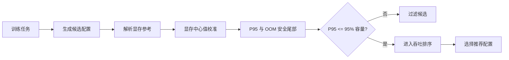

# DeepSpeed SFT 配置推荐器显存模型建模说明

**日期**：2026-07-28  
**适用范围**：H800、Qwen3 SFT、当前 unpacked 核心实验域  
**当前主分析对象**：`physical_shares` 显存 challenger  
**性质**：离线建模与验证说明；当前模型尚未发布为生产 profile

---

## 1. 一句话说明

当前显存模型不是直接用一个黑盒回归预测“会不会 OOM”，而是：

> 先根据模型结构和训练配置计算每张 GPU 的解析显存参考值，再用成功实验校准中心显存，最后利用场景外成功残差和 OOM 下界构造保守的 P95 上界。

推荐器只有在以下条件满足时才放行配置：

$$
M_{\mathrm{operational\ P95}}
\leq
0.95\times C_{\mathrm{device}}
$$

其中：

- $M_{\mathrm{operational\ P95}}$ 是模型预测的单卡显存安全上界；
- $C_{\mathrm{device}}$ 是单卡可报告显存容量；
- 预留 5% 容量是为了避免驱动、框架、碎片和瞬时工作区把理论可行配置推成 OOM。

显存模型与吞吐模型是两个独立模型。显存模型负责安全门控，吞吐模型只在通过门控的候选中排序。



---

## 2. 模型到底预测什么

显存模型面向的是单个训练配置，例如：

- 模型及其结构参数；
- Full fine-tuning 或 LoRA；
- GPU 数量；
- micro batch size，简称 MBS；
- 序列长度；
- ZeRO stage；
- gradient checkpointing，简称 GC；
- dtype、packing 和运行时路径。

当前模型主要输出两个量。

### 2.1 Reserved center

`reserved_center_bytes` 表示正常成功运行时，每张 GPU 的 CUDA reserved 峰值中心预测。

它回答：

> 如果这个配置能够正常运行，通常会占用多少显存？

Reserved 比 allocated 更接近实际 OOM 风险，因为 CUDA allocator 会保留已经申请但当前未被张量直接使用的内存池。

模型也单独拟合了 allocated center，但它目前只用于诊断，不用于最终安全门控。

### 2.2 Operational P95

`operational_p95_reserved_bytes` 是在中心预测之上增加成功残差尾部和 OOM guard 后的安全上界。

它回答：

> 考虑预测误差、allocator 波动和已有 OOM 边界后，这个配置的显存需求应保守估计到多少？

最终准入使用 P95，而不是 center。

---

## 3. 第一层：解析显存参考

### 3.1 为什么需要解析参考

纯数据回归在未见过的模型规模、MBS、序列长度或 ZeRO 组合上容易失控。

因此第一步不拟合任何实验系数，而是根据模型几何和并行策略计算：

$$
M_{\mathrm{ref}}
=
M_{\mathrm{state}}
+M_{\mathrm{activation}}
+M_{\mathrm{workspace}}
$$

这个值称为 `analytic_reference_bytes`。它提供物理量纲和外推骨架，但不是最终预测。

### 3.2 模型状态

模型状态包括参数、梯度和优化器状态。当前解析常量为：

| 状态 | 每参数字节 |
|---|---:|
| BF16 参数 | 2 B |
| BF16 梯度 | 2 B |
| Adam 优化器状态 | 12 B |
| Logits 工作区元素 | 4 B |

设：

- $P_{\mathrm{loaded}}$：实际加载参数量；
- $P_{\mathrm{trainable}}$：需要训练的参数量；
- $N$：GPU 数量。

不同 ZeRO stage 的每卡状态量为：

| ZeRO | 参数 | 梯度 | 优化器 |
|---|---|---|---|
| 0 | $2P_{\mathrm{loaded}}$ | $2P_{\mathrm{trainable}}$ | $12P_{\mathrm{trainable}}$ |
| 1 | $2P_{\mathrm{loaded}}$ | $2P_{\mathrm{trainable}}$ | $12P_{\mathrm{trainable}}/N$ |
| 2 | $2P_{\mathrm{loaded}}$ | $2P_{\mathrm{trainable}}/N$ | $12P_{\mathrm{trainable}}/N$ |
| 3 | $2P_{\mathrm{loaded}}/N$ | $2P_{\mathrm{trainable}}/N$ | $12P_{\mathrm{trainable}}/N$ |

LoRA 下 $P_{\mathrm{trainable}}\ll P_{\mathrm{loaded}}$，因此 LoRA 与 Full 的优化器和梯度显存结构差异很大。

### 3.3 激活与重计算

设：

- $B$：physical MBS；
- $L$：序列长度；
- $D$：层数；
- $H$：hidden size；
- $I$：intermediate size；
- $K$：KV width。

每层每 token 的结构量为：

$$
A_{\mathrm{token,layer}}
=
6H+2K+3I
$$

GC 关闭时，保存完整中间激活：

$$
M_{\mathrm{saved}}
=
B\cdot L\cdot D\cdot A_{\mathrm{token,layer}}\cdot 2
$$

GC 开启时，只保留检查点，并增加一层重计算工作区：

$$
M_{\mathrm{saved,GC}}
=
B\cdot L\cdot D\cdot H\cdot 2
$$

$$
M_{\mathrm{recompute}}
=
B\cdot L\cdot A_{\mathrm{token,layer}}\cdot 2
$$

模型还显式计算 attention 和 logits 工作区。

### 3.4 ZeRO 和临时工作区

解析参考还包括：

- reduce bucket；
- all-gather bucket；
- ZeRO-3 live parameter materialization；
- attention workspace；
- logits workspace；
- recompute workspace。

最终一共得到九个物理分量：

1. `parameters_bytes`；
2. `gradients_bytes`；
3. `optimizer_bytes`；
4. `saved_activations_bytes`；
5. `recompute_workspace_bytes`；
6. `attention_workspace_bytes`；
7. `logits_workspace_bytes`；
8. `zero_collective_workspace_bytes`；
9. `stage3_live_parameters_bytes`。

解析参考为：

$$
M_{\mathrm{ref}}
=
\sum_{k=1}^{9}M_k
$$

---

## 4. 第二层：成功配置的中心值校准

### 4.1 为什么不直接使用解析值

真实运行仍然存在解析公式没有完全描述的因素，例如：

- kernel 实现差异；
- CUDA allocator 保留与碎片；
- ZeRO materialization 时序；
- Full、LoRA、GC 的联合影响；
- MBS、序列长度和模型规模的交互；
- 框架固定开销。

所以模型学习的是“实测 reserved 显存相对解析参考的乘性修正”。

### 4.2 训练标签

对于成功记录 $i$：

$$
y_i
=
\log
\frac{M_{\mathrm{reserved},i}^{\mathrm{observed}}}
{M_{\mathrm{ref},i}}
$$

只使用成功记录拟合中心值，因为 OOM 记录没有真实峰值标签。

### 4.3 特征

当前选中的是 `physical_shares` 特征集，共 28 维。

#### 19 个机制和规模特征

主要包括：

- `is_lora`；
- `gradient_checkpointing`；
- `zero2`、`zero3`；
- LoRA × GC、LoRA × ZeRO、GC × ZeRO；
- LoRA × ZeRO-3 × non-GC；
- $\log_2(\mathrm{GPU\ count})$；
- $\log_2(\mathrm{MBS})$；
- $\log_2(\mathrm{cutoff}/512)$；
- $\log_2(\mathrm{parameters}/1.7B)$；
- 模型规模、GPU、MBS、cutoff 与机制的交互。

#### 9 个物理分量占比

对上一节的每个显存分量计算：

$$
s_k=\frac{M_k}{M_{\mathrm{ref}}}
$$

物理分量占比让模型能够区分：

- 参数状态主导；
- 激活主导；
- optimizer 主导；
- ZeRO workspace 或 stage-3 live parameter 主导。

这比只输入“模型多大、MBS 多大”更接近真实显存机制。

### 4.4 标准化和 Ridge

特征只使用训练集加权统计量标准化：

$$
z_{ij}
=
\frac{x_{ij}-\mu_j}{\sigma_j}
$$

Ridge 目标为：

$$
\min_{\beta_0,\beta}
\sum_i
w_i
\left(
y_i-\beta_0-z_i^\mathsf T\beta
\right)^2
+\alpha\|\beta\|_2^2
$$

截距不惩罚，其他系数使用 Ridge 抑制过拟合。

每个场景的总权重相同，避免某个重复很多的场景支配拟合：

$$
w_i
=
\frac{w_{\mathrm{source}}}
{n_{\mathrm{scenario}(i)}}
$$

当前选中的权重为：

- native calibration 场景：1.0；
- historical 场景：0.25。

最终中心预测为：

$$
\boxed{
\widehat M_{\mathrm{center}}
=
M_{\mathrm{ref}}
\exp
\left(
\beta_0+z^\mathsf T\beta
\right)
}
$$

### 4.5 模型选择

模型选择只使用 native calibration 的 leave-one-scenario-out 结果，不读取 holdout。

搜索空间为：

- 特征集：`basic`、`physical_shares`、`full`；
- Ridge $\alpha$：`0.01, 0.1, 1, 10, 100`；
- historical 场景权重：`0, 0.1, 0.25, 0.5, 1`。

共比较 75 个组合。选择顺序为：

1. 最小 reserved-center 平均相对误差；
2. P90 相对误差；
3. 特征维度更少者优先。

最终选择：

| 参数 | 选中值 |
|---|---|
| Feature set | `physical_shares` |
| 特征维度 | 28 |
| Ridge $\alpha$ | 1.0 |
| Historical scenario weight | 0.25 |

---

## 5. 第三层：成功残差与 OOM 安全尾部

中心值准不代表配置一定安全。门控需要估计预测误差的上尾。

### 5.1 为什么尾部残差必须场景外产生

如果直接使用模型在训练数据上的残差估计 P95，残差会被过拟合压小，安全上界会过于乐观。

因此对每个训练场景：

1. 删除该场景；
2. 在剩余场景上重新拟合中心模型；
3. 预测被删除场景；
4. 收集真正的场景外残差。

成功记录的对数残差为：

$$
r_i^{\mathrm{success}}
=
\log
\frac{M_{\mathrm{reserved},i}^{\mathrm{observed}}}
{\widehat M_{\mathrm{center},i}^{\mathrm{OOF}}}
$$

### 5.2 成功样本的 conformal Q95

对场景外成功残差计算有限样本 95% 上分位数。

尾部按以下层级寻找可用证据：

1. exact selector：
   `(training_mode, zero_stage, GC, packing)`；
2. `training_mode × GC`；
3. 全局 pooled。

如果 exact selector 样本量不足以估计有限样本 Q95，则自动回退到更宽的分组。

### 5.3 OOM 如何进入模型

OOM 记录不知道“真正需要多少显存”，只能说明：

> 该配置的显存需求超过了本次可用边界。

因此 OOM 是右删失下界，不参与中心 Ridge，也不会被填成一个虚假的峰值。

对于 OOM 记录，构造：

$$
r_i^{\mathrm{OOM\ lower}}
=
\log
\frac{
\max
\left(
M_{\mathrm{right\ censor\ lower},i},
M_{\mathrm{safe\ limit},i}+1
\right)
}
{\widehat M_{\mathrm{center},i}^{\mathrm{OOF}}}
$$

同一 exact selector 中取最严格的 OOM 下界作为 guard。

OOM guard 不向更宽分组传播，避免某个局部 OOM 模式无依据地污染所有配置。

### 5.4 最终安全上界

设：

- $q_{95}$：成功样本场景外残差 Q95；
- $g_{\mathrm{OOM}}$：exact selector OOM guard。

最终安全上界为：

$$
\boxed{
\widehat M_{\mathrm{operational\ P95}}
=
\widehat M_{\mathrm{center}}
\exp
\left[
\max
\left(
q_{95},
g_{\mathrm{OOM}},
0
\right)
\right]
}
$$

取 `max(..., 0)` 保证安全尾部不会把中心值向下修正。

---

## 6. 推理时的完整流程

对一个新的候选配置，显存侧执行以下步骤。

### 步骤 1：校验适用域

检查：

- 是否为目标 H800 硬件；
- 模型结构信息是否完整；
- MBS 是否在当前支持域；
- packing 和运行时路径是否属于已支持范围。

### 步骤 2：计算解析分量

根据模型几何、Full/LoRA、GPU、MBS、cutoff、ZeRO、GC 等计算九个显存分量和 $M_{\mathrm{ref}}$。

### 步骤 3：计算 reserved center

构造 28 维特征，使用冻结的训练集均值、标准差和 Ridge 系数：

$$
\widehat M_{\mathrm{center}}
=
M_{\mathrm{ref}}\exp(\beta_0+z^\mathsf T\beta)
$$

### 步骤 4：选择尾部证据

按 `selector → mode × GC → pooled` 选择成功 Q95，同时读取 exact-selector OOM guard。

### 步骤 5：计算 operational P95

$$
\widehat M_{\mathrm{P95}}
=
\widehat M_{\mathrm{center}}
\exp(\max(q_{95},g_{\mathrm{OOM}},0))
$$

### 步骤 6：进行门控

```text
if operational_p95 <= 0.95 * device_capacity:
    memory_safe = true
    允许进入吞吐排序
else:
    memory_safe = false
    过滤该配置
```

---

## 7. 训练集与验证集

### 7.1 最终训练数据

| 数据来源 | Success | OOM | 合计 |
|---|---:|---:|---:|
| Historical memory-boundary | 512 | 82 | 594 |
| Native calibration | 112 | 46 | 158 |
| 合计 | **624** | **128** | **752** |

其中：

- 中心 Ridge 使用 624 条 success；
- 尾部使用成功样本的场景外残差和 128 条 OOM 下界；
- historical 场景权重为 0.25，native 场景权重为 1.0。

### 7.2 选模验证

Native calibration 共 158 条，按完整任务场景进行 leave-one-scenario-out：

$$
\mathrm{scenario}
=
(\mathrm{model},\mathrm{training\ mode},\mathrm{dataset},\mathrm{target\ GBS})
$$

共有 22 个显存场景折。

每一折：

- 从 historical 和 native calibration 中同时删除该场景；
- 重新拟合中心和尾部；
- 在被删除的 native 场景上验证。

### 7.3 冻结 holdout

| Outcome | 条数 |
|---|---:|
| Success | 120 |
| OOM | 47 |
| 合计 | **167** |

Calibration 与 holdout 的 split unit 互不重叠。

模型和超参数先用 calibration 选定，最终模型冻结后才读取 holdout；holdout 训练使用数为 0。

但该 holdout 在更早的 native-memory 报告中已经被查看过，因此它适合同口径模型比较，不再是全新的、完全无偏发布验收集。

---

## 8. 当前预测效果

以下指标均来自相同的167条冻结 native holdout。

### 8.1 中心值误差

| 指标 | Allocated center | Reserved center |
|---|---:|---:|
| 平均相对误差 | 5.64% | **5.55%** |
| 中位相对误差 | 4.60% | **4.74%** |
| P90 相对误差 | 11.69% | **10.75%** |
| 最大相对误差 | 21.63% | **20.45%** |
| 平均绝对误差 | 3.65 GiB | **3.83 GiB** |
| 中位绝对误差 | 2.11 GiB | **2.46 GiB** |
| P90 绝对误差 | 8.77 GiB | **10.73 GiB** |

Reserved center 的平均有符号误差为 `+1.52%`，说明整体略偏高估，但系统性偏差不大。

### 8.2 安全门控效果

| 指标 | 结果 |
|---|---:|
| Success P95 coverage | **116/120 = 96.67%** |
| 错误放行 OOM | **0/47** |
| 实际安全 success | 114 |
| 正确放行安全 success | 99 |
| 错误拒绝安全 success | 15 |
| 安全 success 召回率 | **86.84%** |

这说明：

- 当前 holdout 上没有把 OOM 配置误判成安全；
- P95 覆盖率达到了目标的 95% 以上；
- 代价是模型偏保守，约 13.2% 的实际安全配置被过滤。

### 8.3 与原 native augmented 模型比较

| 指标 | 原 augmented | Physical-shares challenger |
|---|---:|---:|
| Allocated MAPE | 16.14% | **5.64%** |
| Reserved MAPE | 12.29% | **5.55%** |
| Reserved 平均绝对误差 | 8.18 GiB | **3.83 GiB** |
| P95 coverage | 96.67% | 96.67% |
| 错误放行 OOM | 2/47 | **0/47** |
| 错误拒绝安全 success | 19 | **15** |

因此 challenger 的主要改善是中心预测精度和 OOM 门控，而不是单纯把安全余量继续加大。

---

## 9. 与原 native augmented 模型的关系

目录中存在两代显存校准模型。

### 9.1 原 native augmented 模型

原模型采用可解释的加法结构：

$$
M_{\mathrm{allocated}}
=
M_{\mathrm{nonactivation}}
+\lambda_{\mathrm{mode,GC}}M_{\mathrm{activation}}
+M_{\mathrm{runtime\ nuisance}}
$$

然后用层级中位数估计 `reserved - allocated`，最后增加 conformal 和 OOM 尾部。

优点是结构直观，缺点是 Mode、ZeRO、GPU、MBS、cutoff 的联合关系表达不足。

### 9.2 当前 physical-shares challenger

Challenger 改为：

$$
M_{\mathrm{center}}
=
M_{\mathrm{ref}}
\exp(\mathrm{mechanism\ and\ physical\ residual})
$$

它加入机制交互和九个物理分量占比，表达能力更强。

本文后续所称“当前显存模型”均指该 challenger；但工程上它仍是离线候选，还没有自动替换任何生产推荐器。

---

## 10. 与吞吐模型的关系

显存与吞吐不是同一个模型，也不是多任务模型。

| 对比项 | 显存模型 | 吞吐模型 |
|---|---|---|
| 目标 | 预测单卡显存和 OOM 安全 | 对安全候选做吞吐排序 |
| 训练标签 | Allocated/reserved、OOM 下界 | Effective token/s |
| OOM 记录 | 用于安全尾部 | 不进入排序拟合 |
| 主要输出 | Reserved center、operational P95 | Throughput rank score |
| 决策作用 | 过滤不安全配置 | 在安全配置中选择最优 |

两者共享模型大小、GPU、MBS、ZeRO、GC 等输入，也都使用物理解析量，但回归参数和优化目标完全独立。

`joint_throughput_modeling.py` 中的“joint”表示联合优化绝对 step-time 与 pairwise 排序误差，它仍然只是吞吐模型，不包含显存建模。

---

## 11. 当前限制

### 11.1 适用域限制

当前核心证据限制在：

- H800；
- Qwen3 SFT；
- MBS `{1,2,4,8,16}`；
- unpacked；
- 当前已验证的 Full/LoRA、ZeRO、GC 和运行时组合。

以下场景不能直接认为具有同等精度：

- RTX 4090 或其他卡型；
- packing；
- MBS=32；
- 新模型结构；
- 新 attention、optimizer、dtype 或 allocator 路径；
- 超出已观测 GPU 数量和序列长度范围的强外推。

### 11.2 Holdout 不是新的发布验收

虽然 holdout 没有进入拟合或选模，但它在较早报告中已被查看，不能再当作全新的无偏发布验收集。

下一步若要发布，应使用前瞻、未查看场景验证：

- P95 coverage 不低于95%；
- false-safe OOM 为0；
- 无 prediction unavailable；
- 同时控制安全配置误拒绝率；
- 分 selector 检查，而不只看全局平均。

### 11.3 当前仍不可发布

当前产物明确为：

- `publishable=false`；
- 不生成 production profile；
- 不自动修改队列或推荐器；
- 仍需要 prospective unseen-scenario acceptance。

---

## 12. 关键代码与证据

| 内容 | 位置 |
|---|---|
| 解析显存分量 | `offline_experiments/scripts/h800_theory_basis.py::memory_basis` |
| Native augmented 显存模型 | `offline_experiments/scripts/h800_native_memory_calibration.py` |
| Physical-shares challenger | `offline_experiments/scripts/h800_challenger_modeling.py` |
| 特征构造 | `h800_challenger_modeling.py::_memory_features` |
| 中心 Ridge | `h800_challenger_modeling.py::_fit_memory_ridge` |
| 场景外安全尾部 | `h800_challenger_modeling.py::_fit_memory_tail` |
| P95 推理 | `h800_challenger_modeling.py::_predict_memory_upper` |
| 冻结模型与指标 | `offline_experiments/artifacts/h800_challenger_modeling.json` |
| 原 native 模型产物 | `offline_experiments/artifacts/h800_native_memory_calibration.json` |

离线重建 challenger：

```bash
cd /wanqing-develop/luowenjing/Param_Recommend/offline_experiments

/fine-tuning-launcher/.venv/bin/python \
  scripts/h800_challenger_modeling.py
```

该命令只做 CPU 离线拟合和评估，不启动 GPU 实验，也不发布生产 profile。
