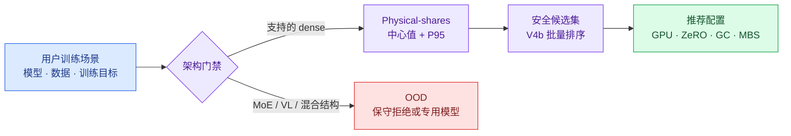

# Qwen 未覆盖模型泛化实验设计

> 状态：预注册设计，尚未生成运行批准文件，尚未启动 GPU 实验  
> 目标硬件：H800 141GB（`nvidia-smi` 报告容量约 139.83 GiB）  
> 训练范围：BF16、文本监督微调（Supervised Fine-Tuning，SFT）、Full（全参数训练）与 LoRA（Low-Rank Adaptation，低秩适配）  
> 当前待验收链路：Physical-shares 显存过滤 + V4b 吞吐排序

## 执行摘要：三种 dense 模型验收迁移，一个 MoE 模型诊断扩域

现有 H800 实验主要覆盖 Qwen3 dense（稠密模型，即每个 token 都经过同一组主干层）1.7B、4B、8B 和 14B。参数量跨度已经不小，但模型架构几乎来自同一个家族。因此，当前结果能说明推荐器在 Qwen3 dense 内部有效，还不能证明它能迁移到另一代 Qwen 架构。

本轮正式验收选择三个此前完全没有运行过的 Qwen2.5 dense checkpoint：

| 模型 | 实际参数量 | 验收角色 |
|---|---:|---|
| `/wanqing-models/Qwen2.5-1.5B` | 1.543714B | 低参数量跨家族迁移 |
| `/wanqing-models/Qwen2.5-14B` | 14.770034B | 与 Qwen3-14B 的近严格同规模对照 |
| `/wanqing-models/Qwen2.5-32B` | 32.763876B | 与 Qwen3-32B 的近严格同规模大模型对照 |

另选 `/wanqing-models/Qwen3-30B-A3B` 做 Mixture of Experts（MoE，混合专家模型）扩域诊断。MoE 的总参数量、每 token 激活参数量、专家路由和潜在的专家并行通信分别影响显存与吞吐，不能直接并入 dense 模型的验收分数。

本设计包含 21 个 dense 主排序场景、6 组 packing ABBA（off/on/on/off）配对和一组 MoE 诊断，预计运行 368–406 个任务，对应约 190–215 个唯一物理配置。它能够检验“当前 dense 推荐器能否迁移到 Qwen2.5，并正确识别 MoE 为分布外（out-of-distribution，OOD）输入”，不能据此宣称已经覆盖 vision-language（VL，视觉语言）、Omni、量化模型或所有硬件。

## 推荐链路：显存模型负责安全，吞吐模型负责择优

用户首先给出一个固定训练需求，包括模型、数据、训练方式、序列上限、目标全局批量和 packing 设置。packing 表示把多条较短样本装入固定长度的物理序列。系统随后枚举 GPU 数、Zero Redundancy Optimizer（ZeRO，优化器状态分片策略）、gradient checkpointing（GC，梯度检查点）和 micro batch size（MBS，单卡微批量）等候选配置。

Physical-shares 负责预测每张卡的显存中心值和 operational P95 上界。这里的 P95 是经过当前证据校准的运行上界，目标是在受支持分布内覆盖约 95% 的正常波动；它不是对 MoE、VL 等新架构的无条件概率保证。V4b 是当前面向候选集合的双头吞吐模型，主要职责是在同一场景的安全候选内给出相对顺序，再输出推荐配置。

*图 1：线上推荐的职责边界。读图方向从左到右；架构门禁先决定现有模型是否适用，显存过滤再先于吞吐排序执行。*

H800 的安全线取报告容量的 95%。它回答“一个候选最多允许占用多少显存”：

$$
M_{\mathrm{safe}}
= 0.95 \times 139.83\ \mathrm{GiB}
\approx 132.84\ \mathrm{GiB}.
$$

$M_{\mathrm{safe}}$ 是单卡显存安全上限。候选只有在预测 P95 不高于 132.84 GiB 时才会进入吞吐排序。若一个被接纳的候选实际发生 OOM，它就是 false-safe；这是显存模型最严重的错误。

## 当前证据：参数规模已有覆盖，架构家族仍然单一

下表来自 `offline_experiments` 和 `offline_experiments_genrun` 中的实际 `rendered_run.json + status.json`，按 `(hardware, job_id)` 去重。`no_status` 记录不计为已验证成功。

| 硬件 | 模型 | 唯一任务 | 唯一配置 | success | OOM | failed | no_status |
|---|---|---:|---:|---:|---:|---:|---:|
| H800 | Qwen3-1.7B | 233 | 91 | 204 | 4 | 0 | 25 |
| H800 | Qwen3-4B | 195 | 93 | 149 | 28 | 0 | 18 |
| H800 | Qwen3-8B | 569 | 239 | 464 | 69 | 1 | 35 |
| H800 | Qwen3-14B | 711 | 216 | 548 | 123 | 1 | 39 |
| H800 | Qwen3-32B | 20 | 11 | 9 | 7 | 2 | 2 |
| H800 | Qwen3-VL-8B-Instruct | 18 | 9 | 14 | 4 | 0 | 0 |
| H800 | Qwen3.6-27B | 4 | 2 | 0 | 0 | 4 | 0 |
| RTX 4090 | Qwen3-0.6B | 480 | 261 | 424 | 56 | 0 | 0 |
| RTX 4090 | Qwen3-1.7B | 425 | 208 | 365 | 60 | 0 | 0 |
| RTX 4090 | Qwen3-4B | 231 | 125 | 179 | 52 | 0 | 0 |

这些数据支持四个直接判断。H800 的主要有效证据集中在 Qwen3 dense。Qwen3-32B 已有结果，但只覆盖较窄的场景。Qwen3-VL-8B 已经表明 VL 的显存行为不能由当前 dense 模型可靠描述。Qwen3.6-27B 的四次运行均失败，因此没有形成可用于显存或吞吐建模的有效覆盖。

Qwen3-0.6B 只在 RTX 4090 上覆盖。它可以用于跨卡型研究，不能替代 H800 上的独立验证。

## 模型盘点：未覆盖 checkpoint 分成五类

`/wanqing-models` 下存在大量名称包含 Qwen 的目录。实验设计按基础架构和训练用途分组，避免把备份、业务微调产物和量化权重当成新的基础模型。

| 类别 | 本地未覆盖模型 | 本轮处理 |
|---|---|---|
| Qwen2.5 dense | 1.5B、7B、14B、32B、72B 的 Base/Instruct | 选择 Base 1.5B、14B、32B |
| Qwen3 dense 新 checkpoint | Qwen3-4B-Instruct-2507 | 几何结构已有大量覆盖，暂缓 |
| Qwen3 MoE | 30B-A3B Base/Instruct/Thinking/Coder、Next-80B-A3B | 选择 30B-A3B Base 做扩域诊断 |
| VL、Omni、混合注意力 | Qwen2/2.5/3-VL、Qwen2.5/3-Omni、Qwen3.5/3.6 | 建立独立验证轨道 |
| 量化与专用任务 | AWQ、FP8、W4A16、W8A8、Image、Embedding、Reranker | 不进入本轮 BF16 文本 SFT |

Qwen3-4B-Instruct-2507 是未运行过的具体权重，但它与已经大量覆盖的 Qwen3-4B 共享主要几何结构。对显存和吞吐机制而言，增加它的边际信息小于增加 Qwen2.5。

DeepSeek-R1-Distill-Qwen、XiYanSQL-QwenCoder 等派生权重也不进入第一轮。它们适合在基础架构迁移通过后，用少量任务检验“相同结构、不同业务权重”的影响。

## 模型选择：同规模对照优先于继续堆叠 Qwen3

### Qwen2.5-1.5B 建立低端跨家族样本

Qwen2.5-1.5B 的实际参数量为 1.543714B。它与已有 Qwen3-1.7B 的 2.031740B 不完全相等，但处在同一个低参数量区间，可以检验执行内核（kernel）启动、通信和固定运行时开销是否造成新的非线性。

### Qwen2.5-14B 提供最干净的架构对照

Qwen2.5-14B 为 14.770034B，已有 Qwen3-14B 为 14.768307B，两者参数量差异约为 0.012%。这个对照基本控制了参数总量，观测差异主要反映层数、注意力几何、tokenizer（分词器）和 template（样本格式模板）。

### Qwen2.5-32B 检验大模型端迁移

Qwen2.5-32B 为 32.763876B，已有 Qwen3-32B 为 32.762123B，同样构成近严格同规模对照。首轮正式吞吐只运行 LoRA。已有 Qwen3-32B Full 在 4×H800、ZeRO-3、GC on 下仍出现 OOM，因此 Qwen2.5-32B Full 先保留两个显存边界负例；出现安全点后再追加吞吐候选。

### Qwen3-30B-A3B 诊断 dense 模型的适用边界

Qwen3-30B-A3B 的实际总参数量为 30.532123B，配置包含 128 个 expert 子网络，每个 token 由路由器选择 top-8 experts，名义激活参数量约为 3B。它与 32B dense 的状态显存可能接近，单 token 计算、专家路由和并行通信路径却明显不同。该模型用于验证 OOD 门禁和后续 MoE 建模需求，不参与 dense 验收均值。

### Qwen2.5-7B 与 72B 作为后续补充

1.5B、14B、32B 已形成低、中、高三个尺度，其中 14B 和 32B 都有近严格同规模的 Qwen3 对照。Qwen2.5-7B 因此作为任务失败时的备用模型。Qwen2.5-72B 在当前 1–4 卡阶段只能覆盖有限训练方式，成本高且缺少可比较的成功候选，留到 8 卡或多机阶段。

## 兼容性检查：四个入选模型可以进入当前加载链路

无 GPU 检查已经验证默认 `/fine-tuning-launcher/.venv` 能读取 Qwen2.5-1.5B、14B、32B 和 Qwen3-30B-A3B 的 `AutoConfig`。四个目录均具有完整 `config.json` 和 safetensors 权重。

两个高价值候选暂不进入正式矩阵：

| 模型 | 当前状态 | 暂缓原因 |
|---|---|---|
| Qwen3-VL-4B-Instruct，4.437816B | 默认环境可以识别 | 当前数据全是文本，只能验证 text-only proxy，无法覆盖图片数、分辨率和视觉 token |
| Qwen3.5-4B，4.659865B | 默认环境不识别；`qwen36_venv` 能读取配置 | 已有 Qwen3.6 尝试出现运行失败和非法显存访问，训练链路尚未稳定 |

“配置可以读取”只说明模型类可以被解析，不代表 FlashAttention 注意力内核、Liger 融合训练算子、DeepSpeed 分布式运行时及其组合已经通过验收。正式矩阵前仍需执行最小 canary，即只运行少量 step 的兼容性冒烟任务。

## 实验单位：场景固定用户需求，候选表示可推荐配置

一个排序场景记为：

$$
s=(m,t,d,L,B,p).
$$

这里 $s$ 是一个场景元组；$m$ 表示模型，$t$ 表示 Full 或 LoRA，$d$ 表示原始数据切片，$L$ 表示 `cutoff_len`，$B$ 表示目标 global batch size（GBS，全局批量），$p$ 表示 packing 开关。

场景中的一个候选配置记为：

$$
c=(g,z,k,b).
$$

$c$ 也是一个元组；$g$ 表示 GPU 数，$z$ 表示 ZeRO 策略，$k$ 表示 gradient checkpointing（GC，梯度检查点）开关，$b$ 表示 micro batch size（MBS，单卡微批量）。比较只发生在同一个 $s$ 内，因此吞吐排序回答“这个用户需求应该选择哪个资源配置”。不同模型之间的速度比较属于另一评估层级。

候选必须满足批量整除关系：

$$
B = g \times b \times a,
$$

其中 $a$ 是 gradient accumulation steps（梯度累积步数），为正整数。当前矩阵没有 tensor parallel 或 pipeline parallel，所以 $g$ 同时等于数据并行度。该等式适用于主矩阵的 `packing=false` 场景；packing 配对使用有效样本 GBS 单独校验，物理容器数不直接当作样本数。

## Dense 主矩阵：21 个场景覆盖模型、数据与 GBS

### 15 个基础场景保持 GBS 一致

基础场景统一使用 `target_gbs=64`，先隔离模型家族和数据分布的影响。

| 模型 | 训练方式 | 数据切片 | 场景数 |
|---|---|---|---:|
| Qwen2.5-1.5B | Full、LoRA | `short_512`、`multiturn_4096`、`longtail_8192` | 6 |
| Qwen2.5-14B | Full、LoRA | `short_512`、`multiturn_4096`、`longtail_8192` | 6 |
| Qwen2.5-32B | LoRA | `short_512`、`multiturn_4096`、`longtail_8192` | 3 |

这 15 个场景形成完整的低、中、高规模对照。Qwen2.5-32B Full 的两个显存负例单列，不计为吞吐排序场景。

### 6 个 GBS 场景检验批量外推

额外加入：

- Qwen2.5-1.5B，Full/LoRA，`short_512`，GBS=32 和 128，共 4 个场景；
- Qwen2.5-14B，LoRA，`multiturn_4096`，GBS=32 和 128，共 2 个场景。

Dense 主验收因此包含 21 个排序场景。Qwen2.5-1.5B 另补 `longcontext_16384` 的 Full/LoRA 两个扩展场景，用于暴露长上下文风险；它们单列报告，避免改变主验收集。

### 数据切片使用相同原始样本并重新分词

跨模型实验复用相同原始样本 ID，不复用 Qwen3 已分词的 token。每个 Qwen2.5 模型使用自身 tokenizer 和正确模板重新编码，并记录 mean、P50、P90、P99、max、有效 token 比例和 $\sum_i \ell_i^2$。

$\ell_i$ 表示第 $i$ 条样本的 token 长度，$\sum_i \ell_i^2$ 是注意力计算量的分布代理。相同 `cutoff_len` 只规定最大长度，不保证两个数据集具有相同的实际 token 数和注意力开销。

## 候选抽样：显存边界与吞吐竞争者分别覆盖

每个场景先枚举合法候选。GPU 数取 1、2、4；单卡不使用 DeepSpeed；多卡使用 ZeRO-2 或 ZeRO-3；GC 取 on/off；MBS 从 1、2、4、8、16 中选择，并满足 GBS 整除关系。

### 显存探针覆盖安全区和拒绝边界

在查看真实结果前，使用冻结的 Physical-shares 预测选出四到五个探针：

1. 明显安全点；
2. P95 接近安全线但仍被接纳的点；
3. 第一个被 P95 拒绝的负例；
4. 不同 ZeRO/GC 机制的对照点；
5. 必要时增加不同 GPU 数的对照点。

每个探针先运行一次。距离安全线很近、预测分类与实际冲突或峰值波动异常的点再重复一次。OOM 是显存边界证据，必须保留在验收集中。

### 吞吐候选同时包含 V4b 首选和独立 challenger

显存结果形成可运行区域后，每个场景保留五个成功候选：

1. V4b 排名第一；
2. V4b 排名第二；
3. 不同 GPU 数中最有竞争力的配置；
4. 不同 ZeRO/GC 机制的配置；
5. 独立 challenger，例如最大安全 MBS 或 V5/规则模型的首选。

每个候选正式运行两次，运行顺序随机并尽量采用镜像顺序，以降低温度和共享负载漂移。一个场景若不足四个成功且互不相同的候选，只能提供显存证据，不计入排序验收。

## 数值示例：排序偶尔出错仍可得到低 regret

下面使用一个教学示例说明三个指标如何同时解读。数字不来自真实任务，只用于展示计算。固定场景为 Qwen2.5-14B、LoRA、`multiturn_4096`、GBS=64、packing off。

| 候选 | GPU / ZeRO / GC / MBS | 预测 P95 | 显存门禁 | V4b 预测顺序 | 实际吞吐 |
|---|---|---:|---|---:|---:|
| A | 4 / Z2 / off / 4 | 119 GiB | 接纳 | 1 | 9,800 token/s |
| B | 4 / Z3 / on / 8 | 127 GiB | 接纳 | 2 | 10,000 token/s |
| C | 2 / Z3 / on / 2 | 110 GiB | 接纳 | 3 | 9,200 token/s |
| D | 4 / Z2 / off / 8 | 136 GiB | 拒绝 | 不排序 | 未运行 |

Physical-shares 先拒绝 D。V4b 在 A、B、C 中选择 A，而实际最优是 B。场景 regret 定义为：

$$
r_s=\frac{T_s^\star-T_s^{\mathrm{sel}}}{T_s^\star}.
$$

$T_s^\star$ 是场景 $s$ 中实际最优的安全吞吐，$T_s^{\mathrm{sel}}$ 是推荐配置的实际吞吐。代入示例得到：

$$
r_s=\frac{10{,}000-9{,}800}{10{,}000}=2\%.
$$

Hit@90 判断推荐吞吐是否达到最优值的 90%：

$$
h_s=\mathbf{1}\!\left[T_s^{\mathrm{sel}}\ge 0.9T_s^\star\right].
$$

$\mathbf{1}[\cdot]$ 是指示函数，条件成立时为 1，否则为 0。示例中 $9{,}800 \ge 9{,}000$，所以 `Hit@90=1`。

三对可比较候选分别为 A–B、A–C、B–C。V4b 只排错 A–B，pairwise accuracy 为 $2/3=66.7\%$。这个例子说明 pairwise accuracy 衡量整体排序一致性，regret 和 Hit@90 衡量最终选择是否接近最优；三者需要同时报告。

## Packing 配对：相同 cutoff 仍可能产生不同显存与吞吐

`cutoff_len` 规定单条编码序列的最大长度。packing 会把多条短样本装入同一物理序列，使每个 micro batch 的有效 token 数、padding 比例和样本边界发生变化。因此，相同 cutoff 不意味着 packing on/off 的实际激活量和计算量相同。

本轮选择六个配置做 ABBA 配对。A 表示 packing off，B 表示 packing on；运行顺序为 off/on/on/off，用镜像顺序降低机器状态漂移。

| 配对 | 模型与训练方式 | 数据分布 |
|---:|---|---|
| 1 | Qwen2.5-1.5B Full | `short_512` |
| 2 | Qwen2.5-1.5B LoRA | `longtail_8192` |
| 3 | Qwen2.5-14B Full | `short_512` |
| 4 | Qwen2.5-14B LoRA | `multiturn_4096` |
| 5 | Qwen2.5-32B LoRA | `short_512` |
| 6 | Qwen2.5-32B LoRA | `longtail_8192` |

每对固定模型、原始样本、cutoff、GPU 数、GBS、ZeRO、GC 和优化器，只改变 packing。六组共 24 个任务。结果按数据分布和模型规模分别报告，不压缩成一个全局 packing 系数。

## MoE 诊断：总参数量、激活参数量与通信共同决定结果

对 dense 模型，参数状态和计算量通常随同一个参数规模增长。MoE 将两者拆开。Qwen3-30B-A3B 需要保存约 30.5B 参数，却只为每个 token 激活部分 experts，并增加专家路由开销。采用 expert parallel 时还会引入 all-to-all 通信；当前 ZeRO 路径是否产生对应通信，需要由实际运行机制记录确认。

MoE 单卡显存可以先用以下结构理解：

$$
M_{\mathrm{MoE}}
\approx
M_{\mathrm{state}}(P_{\mathrm{total}},z,g)
+M_{\mathrm{act}}(L,b,k)
+M_{\mathrm{runtime}}.
$$

$P_{\mathrm{total}}$ 是总参数量；$z$、$g$ 分别是 ZeRO 策略和 GPU 数；$L$、$b$、$k$ 分别是序列长度、MBS 和 GC 开关。该式是组成关系，不是已经校准好的 MoE 预测公式。

一步训练时间还需要增加专家计算和通信：

$$
t_{\mathrm{step}}
\approx
t_{\mathrm{attention}}
+t_{\mathrm{expert}}(P_{\mathrm{active}})
+t_{\mathrm{route/comm}}.
$$

$P_{\mathrm{active}}$ 是每 token 激活参数量。最后一项表示路由以及当前并行实现产生的通信，受 expert balance（token 在 experts 之间的负载均衡程度）、ZeRO 或 expert parallel 策略和互联影响。当前 V4b 没有完整编码这些变量，因此 MoE 应先被架构门禁标记为 OOD。

MoE 首轮运行三个 LoRA 场景：`short_512`、`multiturn_4096`、`longtail_8192`，GBS 均为 64。每个场景约四个显存探针和四个安全吞吐候选，吞吐候选重复两次。Full 只运行 4×H800、ZeRO-3、GC on 的 MBS=1 canary 和一个预注册不安全点。

## 冻结顺序：14B 与 32B 保持为真正留出

泛化验收要求预测先于结果冻结。prediction ledger（预测台账）保存每个候选在运行前得到的模型版本、输入和预测值。推荐器若在查看某个模型结果后重新拟合，该模型就变成校准集，不能继续作为未触碰留出集。

*图 2：留出集的执行顺序。当前模型对全部新场景的预测先冻结；若用 1.5B 校准 vNext，vNext 对 14B/32B 的预测也必须在查看结果前冻结。*

当前 Qwen3-32B 和 Qwen3-VL-8B 的结果已经被查看过，只能作为后验验证或校准材料，不能再声称是未触碰的最终留出。

## 验收指标：安全是硬门槛，排序关注最终选择质量

### 显存指标约束 Physical-shares

| 指标 | 定义 | 门槛 |
|---|---|---:|
| false-safe OOM | P95 接纳后实际 OOM 的任务数 | 0 |
| 安全线违规 | P95 接纳后实际峰值超过 132.84 GiB 的成功任务数 | 0 |
| P95 coverage | 成功任务中“实际峰值不高于预测 P95”的比例 | ≥95% |
| safe recall | 实际安全配置中被 P95 接纳的比例 | ≥85% |
| center P90 error | 绝对相对误差 $\lvert \widehat M-M\rvert/M$ 的第 90 百分位 | ≤15% |

false-safe OOM 和安全线违规是发布硬门槛。中心误差再低，只要推荐器会把 OOM 配置判为安全，显存过滤器就不能投入自动推荐。

### 排序指标约束 V4b

| 指标 | 定义 | 门槛 |
|---|---|---:|
| pairwise accuracy | 实际吞吐不同的候选对中，预测顺序正确的比例 | ≥90% |
| Hit@90 | 推荐吞吐达到场景最优 90% 的场景比例 | ≥90% |
| mean regret | 所有有效场景 regret 的平均值 | ≤5% |
| P90 regret | 场景 regret 的第 90 百分位 | ≤10% |
| 端到端 OOM | 显存过滤后最终推荐仍 OOM 的任务数 | 0 |

21 个主场景对应的 Hit@90 门槛至少为 19 个场景通过。绝对吞吐的 mean absolute percentage error（MAPE，平均绝对百分比误差）继续记录，用于诊断校准偏差，不作为 V4b 的主要发布门槛。

### 统计范围限制产品结论

即使 21 个 dense 场景全部 Hit@90，样本量仍不足以支持“所有 Qwen 配置均可靠”的声明。在独立同分布和零失败的简化假设下，rule of three 给出的 95% 失败率上界约为：

$$
\frac{3}{21}\approx14.3\%.
$$

该计算只用于说明样本量，不替代分层统计。最终产品验收仍需要更多模型家族、数据分布和至少 30 个未触碰排序场景。

## 任务预算：368–406 个任务形成第一批跨家族验收

| 部分 | 预计任务 |
|---|---:|
| Dense 21 个主场景的显存探针 | 84–105 |
| Dense 每场景 5 个候选 × 2 次重复 | 210 |
| Packing 6 组 ABBA | 24 |
| 32B Full 负例、长上下文、canary 与异常复验 | 12–25 |
| Qwen3-30B-A3B MoE 诊断 | 38–42 |
| 合计 | 368–406 |

预计包含约 190–215 个唯一物理配置，其余任务用于正式重复。实验按阶段执行：模型 canary 先于批量任务；显存边界先于正式吞吐；1.5B 先于 14B/32B 留出；dense 验收先于 MoE 扩域。

出现以下情况时暂停后续发射并审查设计：

- 入选模型无法通过当前生产 kernel、Liger 和 DeepSpeed 组合的 canary；
- 出现第一个被 Physical-shares 接纳的 OOM；
- 同一场景的重复吞吐波动超过预设健康阈值；
- 一个排序场景最终不足四个互不相同的成功候选；
- 冻结产物（artifact）、数据、运行时或候选规则发生变化。

## 交付边界：本文没有授权启动实验

本文完成模型盘点、选择、场景定义、指标和预算。真正执行前还需要：

1. 将入选模型加入独立的新实验 catalog；
2. 使用 Qwen2.5 原生 tokenizer 重新生成并冻结数据画像；
3. 冻结 Physical-shares、V4b、候选生成规则和预测 ledger；
4. 生成 dry-run 任务矩阵并复核唯一配置数；
5. 绑定运行时、数据、模型和脚本 SHA256；
6. 通过人工批准文件后再启动 GPU 任务。

在这些步骤完成前，目录中的任何 pending 设计都不应被解释为正在运行的实验。

## 附录：未覆盖模型的具体范围

### Qwen2.5 dense

- Qwen2.5-1.5B、1.5B-Instruct；
- Qwen2.5-7B、7B-Instruct；
- Qwen2.5-14B、14B-Instruct；
- Qwen2.5-32B、32B-Instruct；
- Qwen2.5-72B、72B-Instruct。

### Qwen3 MoE

- Qwen3-30B-A3B；
- Qwen3-30B-A3B-Instruct-2507；
- Qwen3-30B-A3B-Thinking-2507；
- Qwen3-Coder-30B-A3B-Instruct；
- Qwen3-Next-80B-A3B-Instruct。

### VL、Omni 与混合注意力

| 家族 | 未覆盖模型 |
|---|---|
| Qwen2-VL | 7B |
| Qwen2.5-VL | 3B、7B、32B、72B |
| Qwen3-VL | 2B、4B、30B-A3B、32B |
| Qwen2.5-Omni | 3B、7B |
| Qwen3-Omni | 30B-A3B |
| Qwen3.5 | 0.8B、4B、9B、27B |
| Qwen3.6 | 27B、35B-A3B |

量化 checkpoint、备份目录、mcore 转换目录、微调产物、Image、Embedding 和 Reranker 不属于本轮基础 BF16 文本 SFT 验收对象。
